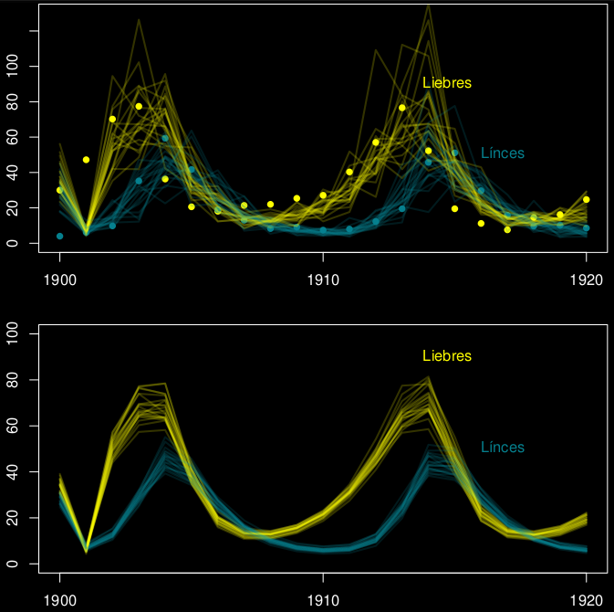
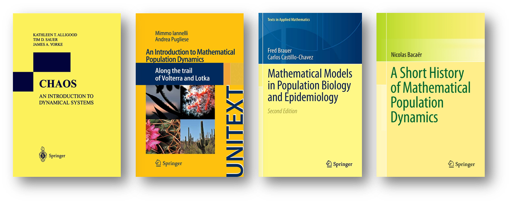

# Modelación bayesiana de un sistema de especies que compiten.
Combinando el poder de la estadística bayesiana y la teoría de sistemas dinámicos, aquí se presenta una aplicación interesante en el mundo real del flujo de trabajo bayesiano.

Basado en [Carpenter, B. 2018](https://mc-stan.org/users/documentation/case-studies/lotka-volterra-predator-prey.html) se ha mejorado y agregado originalidad al flujo de trabajo bayesiano presentado. Esto se logró incluyendo pasos adicionales, como la calibración basada en simulación, además
pronóstico y retrospectiva, y un análisis detallado del sistema dinámico definido por las [ecuaciones de Lotka-Volterra](https://en.wikipedia.org/wiki/Lotka%E2%80%93Volterra_equations).

Este es un trabajo en colaboración con [Brandon Hernández](https://github.com/BrandonHT)



## Estructura de repositorio
```
.
├── RMarkdowns/             # Material fuente de para reporte final (RMarkdown).
├── data/                   # Datos utilizados en el proyecto.
└── docs/                   # _Handouts_ de presentaciones de avance y reporte final en formato PDF.
    └── portada/
    └── presentaciones/
    └── final_report.pdf
├── images/                 # Material visual de apoyo (png).
└── models/                   # Directorio con los modelos de Stan.
    └── compiled/
    └── raw/
├── renv/                     # Archivos de estructura de ambiente (R).
├── utilities/                # archivos .R; .tex y .bib para funciones de R y formato del reporte final.
├── README.md

```

## Referencias


- Carpenter, B. 2018. “Predator-Prey Population Dynamics: The Lotka-Volterra Model in Stan.” [Liga](https://mc-stan.org/users/documentation/case-studies/lotka-volterra-predator-prey.html)
- Alligood, K., T. D. Sauer, and K. Yorke J. A. 1996. CHAOS: An Introduction to Dynamical Systems. Springer.
- Bacaër, N. 2011. A Short Story of Mathematical Population. Springer.
- Brauer, F., and Castillo-Chavez, C. 2012. Mathematical Models in Population Biology and Epidemiology. Vol. 40. Texts in Applied Mathematics. New York, NY: Springer New York. [Liga](https://doi.org/10.1007/978-1-4614-1686-9)
- Czajkowski, C., and P. Schillak. 1990. “Iterative Solutions of the Lotka-Volterra Equations.” Il Nuovo Cimento D 12: 1477–80.
- Howard, P. 2009. “Modeling Modeling Modeling Basics Basics Basics. Lecture Notes for Math 442, Texas A&M University.”
- Iannelli,M., and Pugliese, A. n.d. An Introduction to Mathematical Population Dynamics. Vol. 79. Springer.
- Murty, K. N., M. A. S Srinivas, and K. R Prasad. 1990. “Approximate Analytical Solutions to the Three-Species Ecological System.” Journal of Mathematical Analysis and Applications 145 (1): 89–99.
- Volterra, V. 1926. “Variazioni E Fluttazioni Del Numero d’individui in Specie Animali Conviventi.” Mem. Acad. Sci. Lincei 2: 31–113.
- PROFEPA. 2023. Vaquita marina: La marsopa más pequeña del mundo. [Liga](https://www.gob.mx/profepa/es/articulos/vaquita-marina-la-marsopa-mas-pequena-del-mundo?idiom=es) 
