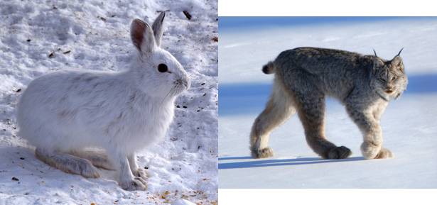
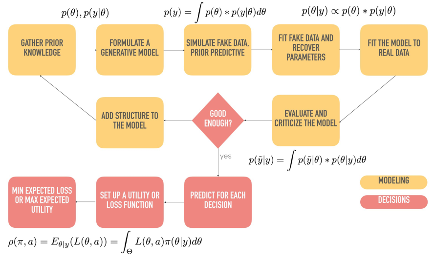

```{r echo=FALSE, eval=FALSE, message=FALSE, warning=FALSE}
renv::restore()
```

```{r echo=FALSE, eval=FALSE}
# the Distill output format allows url, affiliation, and affiliation_url to be specified.
# install.packages("distill")
library(distill)
```

```{r eval=FALSE, echo=FALSE}
# actualiza la versión de tinytex y tglm
tinytex::install_tinytex()
# instala el paquete tcolorbox
tinytex::parse_packages(
  text = "! LaTeX Error: File `tcolorbox.sty' not found."
)
```

```{r echo=FALSE, eval=FALSE}
rmarkdown::render("RMarkdowns/reporte_final.Rmd", 
                  output_file = "../docs/reporte_final/reporte_final_predaBayes.pdf", 
                  clean = TRUE)
```

```{r source, echo=FALSE, message=FALSE, warning=FALSE}
source('../utilities/config.R')
```

\newpage

\listoffigures

\newpage

\listoftables

\newpage

# Introducción

> _Life's most important problems are, for the most part, problems of probability._ (Laplace, Pierre-Simon; 1812)

En 1920 Lotka publicó un artículo titulado "Apunte analítico sobre ciertas relaciones en los sistemas orgánicos". 
En él, propuso un `sistema dinámico`^[véase definición  \@ref(def:dynamical-system)]
que describe el tamaño poblacional de dos especies. El ejemplo que consideró fue el de una población 
de herbívoros (`depredadores`) cuyo principal recurso de sobrevivencia son plantas (`presas`) del mismo hábitat y
cuyas poblaciones crecen, en cada unidad de tiempo, a una velocidad:

\begin{equation}
\begin{aligned}
\diff{u}{t}&=u(\alpha-\beta v)\\
\diff{v}{t}&=v(-\gamma + \delta u)
\end{aligned}
\label{eq 1: LV_model}
\end{equation}

en donde $u(t)$ y $v(t)$ denotan el tamaño de la población de hervíboros 
y plantas al tiempo $t\geq0$ respectivamente. Los parámetros $\alpha$, $\beta$, $\gamma$ y $\delta$ son estimados 
a menudo a partir de datos de poblaciones _presa-depredador_ durante un período determinado. 


En este trabajo, abordamos un \texttt{problema inverso}: Si el tamaño poblacional 
es conocido en un periodo de tiempo ¿cuáles son los parámetros que dieron lugar a tal comportamiento 
en el tamaño de las poblaciones?. Para ello se realiza una estimación del vector de parámetros $\theta = (\alpha, \beta, \gamma, \delta)$ desde 
una perspectiva de Estadística Bayesiana usando `Stan`. 

La estimación de los parámetros es fundamental para comprender la dinámica de algún par de poblaciones específico
así como el comportamiento por su interacción mutua. Profundizamos sobre la interpretación de los 
mismos en la siguiente sección.


Para conseguir nuestro objetivo nos basamos en el artículo de @base_article disponible en el sitio web de \texttt{Stan}. 
En particular, utilizamos los datos de la cantidad de pieles de línces canadienses y liebres recogidas por la Compañía de la Bahía de Hudson en los años 1900-1920 [@howardp.2009], 
que son proporcionados en este mismo artículo. 
Estos datos son relevantes para nuestro estudio ya que nos permiten analizar la relación entre la población de depredadores y presas en un ecosistema, 
y validar nuestro modelo teórico mediante la comparación con resultados empíricos.

 

En nuestro trabajo, hemos mejorado y agregado originalidad al flujo de trabajo bayesiano presentado en el artículo base. Esto se logró mediante la inclusión de etapas adicionales, tales como chequeos previos, la calibración basada en simulación, además de _forecasting_ y _backcasting_, y un análisis detallado del sistema dinámico definido en la ecuación (\ref{eq 1: LV_model}).

Gracias a estas adiciones, hemos logrado obtener una comprensión más profunda y completa del comportamiento del sistema, lo cual no fue abordado en el artículo base de @base_article. Esperamos que el lector también pueda beneficiarse de estas mejoras y comprender mejor el sistema que hemos analizado.


\newpage

# Descriptivo de modelo

En la presente sección, se describe con mayor detalle la especificación del modelo 
y se provee al lector de algunas referencias bibliográficas relevantes para
consultar información adicional.

## Enfoque de sistemas dinámicos

@volterrav.1926 propuso el mismo modelo que Lotka, pero con un enfoque diferente. 
Mientras que Lotka se enfocó en el estudio de la dinámica de las poblaciones animales, Volterra abordó la pregunta de si sería posible explicar
las fluctuaciones que se habían observado en la población de peces del mar Adriático y 
que preocupaban mucho a los pescadores en épocas de baja población de peces.

\begin{modelo}[ (Lotka-Volterra)]
\begin{equation}
\begin{aligned}
\diff{u}{t}&=u(\alpha-\beta v)\\
\diff{v}{t}&=v(-\gamma + \delta u)
\end{aligned}
\label{eq 2: LV_model}
\end{equation}
\end{modelo}

### Supuestos
El modelo de Lotka Volterra asume los siguientes puntos, según lo indicado por @brauer2012 p.123

\begin{supuestos}
\begin{enumerate}
  \item La fuente principal de alimento de las presas es ilimitada
  y por lo tanto la tasa de crecimiento per capita de la población 
  de presas, en ausencia de depredadores, es constante.
  \item La principal fuente de alimentación de los depredadores son las presas y en un escenario de ausencia de presas, la tasa de mortalidad de los depredaodres es constante.
  \item En presencia de presas, la tasa de crecimiento de los depredadores incrementa de manera lineal en relación a la población de presas.
  \item En presencia de depredadores, la población de presas dismminuye de manera lineal en relación a la población de depredadores.
\end{enumerate}
\end{supuestos}

### Interpretación

Es importante hacer notar que, bajo los supuestos del modelo LV,
se puede dar la siguiente interpretación a los parámetros de (\ref{eq 2: LV_model}).

\begin{table}[h!]
\centering
\begin{tabular}{| c | l |}
\hline
\textbf{Notación} & \textbf{Significado} \\
$\alpha\geq0$ & Tasa de crecimiento de las presas en asuencia de depredadores. \\
$\gamma\geq0$ & Tasa de mortalidad de los depredadores en ausencia de presas.  \\
$\beta v > 0$ & Tasa de mortalidad de la población de presas debida a la interacción con depredadores. \\
$\delta u > 0$ & Tasa de crecimiento de la población de depredadores debida a la interacción presas. \\

\hline
\end{tabular}
\end{table}

\newpage 

## El papel de la estadística bayesiana 

El modelo presentado en la ecuación (\ref{eq 2: LV_model}) es \texttt{determinista} lo que significa que, si los parámetros 
y los tamaños poblacionales fuesen
perfectamente conocidos, sería posible predecir exactamente todos los estados futuros. Para lograr hacer predicciones se hará inferencia del valor de los parámetros basados en los datos observados.

Después de lo anterior, el lector curioso podría preguntarse: `¿En qué punto de la solución están involucradas las soluciones del modelo LV?`.
Asumiremos que el número de pieles recolectado está asociado con 
el tamaño de las poblaciones de presas y depredadores. Como primer propuesta
asumimos que,
en promedio,
el tamaño de las poblaciones en cada momento del tiempo y el número de pieles recolectado 
para cada especie son iguales y que 
hay posible variación por error de medición y simplificación del modelo.

De manera simple y adoptando un esquema similar al de regresión lineal simple,
donde el predictor lineal se sutitye por las soluciones 
del sistema LV, la descripción 
anterior se traduce en contemplar el modelo

\begin{align*}
\text{número de pieles observado en presas}&= \text{número de presas} + \epsilon_1\\
\text{número de pieles observado en depredadores}&= \text{número de depredadores} + \epsilon_2
\end{align*}

con una ligera modificación: dado que las cantidades involucradas (número de pieles y tamaño de las poblaciones) son positivas, tenemos que restringir de alguna manera a que los términos de error sean no negativos. La manera más 
simple de hacerlo es considerar al número de pieles y tamaño de las poblaciones en escala logarítmica y en la siguiente sección damos más detalle
sobre esto.

### Especificación del modelo bayesiano. {#especificacion-modelo}

Con el modelo bayesiano que utilizamos, podemos cuantificar la incertidumbre en los parámetros mediante la asignación de una distribución previa. Una de las ventajas de este enfoque respecto de otros (como métodos de optimización), es que permite incoporar conocimiento previo acerca de estos y actualizarlo con los datos observados. 

En esta sección, detallaremos la especificación del modelo estadístico que utilizamos y explicaremos cómo asignamos la distribución previa a los parámetros. Esto nos permitirá avanzar en nuestra tarea de modelado con una comprensión profunda del enfoque bayesiano que estamos utilizando y cómo esto nos permite cuantificar la incertidumbre en los resultados de nuestro modelo.

### Verosimilitud

Ahora, se especificará un modelo probabilístico
que describa el proceso que generó los datos. En él, relacionaremos el número de pieles observado 
y el tamaño poblacional de estas dos especies. Para ello, tomaremos en cuenta que los datos 
del número de pieles son una aproximación del tamaño de las poblaciones.

Para cada momento del tiempo $n\geq 1$, sea $y_n=(u_n, v_n)$ en donde

- $u_n$ denota el número de pieles observado para las presas.

- $v_n$ denota el número de pieles observado para los depredadores.

y para cada $t=1,\dots, M$, sean  

\begin{align}
           \mathbf{z}_t =
         \begin{bmatrix}
           u(t) \\
           v(t) \\
         \end{bmatrix}
  \end{align}

las soluciones del modelo LV al tiempo $t$, dados los parámetros $\theta = (\alpha, \beta, \gamma, \delta)$
y la condición inicial $\mathbf{x}_{init}=[u(t=0), v(t=0)]$.

\begin{Nota}
Cada $\mathbf{z}_j$ es aleatoria pues es función de los parámetros $\mathbf{x}_{init}$ y 
$\theta = (\alpha, \beta, \gamma, \delta)$.
\end{Nota}

\newpage

Dado que las variables que incluiremos en el modelo son positivas, pues son tamaños de poblaciones, 
lo que haremos
es relacionar $\log(\text{cantidad de pieles})>0$ 
y $\log(\text{tamaño de poblacion})>0$. Esta transformación tiene la ventaja de 
poder emplear el enfoque de regresión lineal normal clásico y por lo tanto los errores 
no están restringidos a ser positivos.

Más precisamente,

\begin{modelo}
\begin{equation}
\begin{aligned}
           \log(u_{n}) &= \log(u(n; \mathbf{x}_{init},\theta )) + \epsilon_1 \\
           \log(v_{n}) &= \log(v(n; \mathbf{x}_{init}, \theta)) + \epsilon_2
\end{aligned}
\label{eq 3: LR_model}
\end{equation}
con $\epsilon_i \sim \normal{0}{\sigma_i}, i=1,2$ o bien 
\begin{align*}
\log(u_n) \mid \mathbf{x}_{init},\theta  \sim \normal{\log(x(n))}{\sigma_1}\\
\log(v_n) \mid \mathbf{x}_{init},\theta  \sim \normal{\log(y(n))}{\sigma_2}
\end{align*}
\end{modelo}

En donde los términos de error representan:

- Falta de certeza en que las mediciones 
se generaron cumpliendo los supuestos del modelo LV, . Así que, aún si conocieramos  
el verdadero valor de los parámetros que dieron lugar a éstas 
y usaramos el modelo LV para calcular los tamaños poblacionales 
en cada momento del tiempo, entonces los resultados no coincidirían exactamente 
con los datos observados.

- Existen variables como el clima, enfermedades infecciosas y otros factores de largo plazo 
que provocan variación en el tamaño de las poblaciones y que no incluiremos en 
nuestro proceso de modelado [@base_article].

Por otro lado, otra forma de expresar el modelo (\ref{eq 3: LR_model}) es la siguiente. 

\begin{equation}
\begin{aligned}
u_n&=\exp(\log(u(n; \mathbf{x}_{init},\theta))+ \epsilon_1)\\
   &= u(n; \mathbf{x}_{init},\theta )\exp(\epsilon_1)
\end{aligned}
\label{modelo_proporcion}
\end{equation}

y como 

$$\log(u(n; \mathbf{x}_{init},\theta))+\epsilon_1:=Z \sim \normal{\log(u(n; \mathbf{x}_{init},\theta))}{\sigma_1}$$

entonces $U_n\sim \lognormal{0}{\sigma_1}$ y concluiriamos similarmente para $V_n$.
Eso nos lleva a expresar el modelo en (\ref{eq 3: LR_model}) como sigue:
\begin{modelo}
\begin{align*}
u_n \mid \mathbf{x}_{init},\theta  \sim \lognormal{\log(u(n))}{\sigma_1}\\
v_n \mid \mathbf{x}_{init},\theta  \sim \lognormal{\log(v(n))}{\sigma_2}
\end{align*}
\end{modelo}

\begin{Nota}
La intención de expresar de otra manera nuestro modelo es para notar que, en promedio, el número 
de pieles recolectadas es proporcional al tamaño de la población, con un factor de corrección que 
tiene en cuenta algún porcentaje del total. 

En efecto, sin pérdida de generalidad considere únicamente la relación descrita para las presas 
según la ecuación (\ref{modelo_proporcion}), entonces

\begin{align*}
\frac{u_n}{u(n; \mathbf{x}_{init},\theta )}&=\mathbb{E}\left[\exp(\epsilon_1)\mid u_n, u(n; \mathbf{x}_{init},\theta)\right]\\
&=\exp(0+\sigma_1^2/2)
\end{align*}

siempre que $u(n; \mathbf{x}_{init},\theta)\neq 0$ y donde para la última igualdad 
hemos hecho uso del Teorema 1 del Apéndice.
\end{Nota}

\newpage 

### Previas

El último paso para completar el modelo bayesiano corresponde a la definición de nuestro conocimiento previo
mediante distribuciones, las cuales nos permitan delimitar las regiones de valores que puede tomar cada uno
de los parámetros en cuestión. De esta manera, procedemos a incluir nuestro conocimiento previo para los 
parámetros $\theta = (\alpha, \beta, \gamma, \delta)$ y $\mathbf{x}_{init}$, considerando el significado 
de cada parámetro y la forma en que fueron codificados los datos (en miles). Sabemos de los datos que las 
mediciones del número de pieles para ambas especies son del orden de $10^{1}$, por lo que, de acuerdo con 
[@base_article], estableceremos las siguientes previas:

\begin{align*}
\alpha, \gamma \sim \normal{1}{0.5}\\
\beta, \delta \sim \normal{0.05}{0.05}
\end{align*} 

Si bien estas distribuciones son un poco vagas en el sentido de tener mucha varianza, nos pemiten deliminar 
los posibles valores que pueden tomar los parámetros considerando la escala de los datos y el contexto del 
problema. Posteriormente en la subsección **Chequeos predictivos previos** evaluaremos el efecto de nuestros 
supuestos distribucionales para los parámetros en cantidades observables.

\newpage 

# Análisis exploratorio 

```{r echo=FALSE}
lynx_hare_df <-
  read.csv("../data/hudson-bay-lynx-hare.csv",
           comment.char="#")
names(lynx_hare_df) <- c('Año','Linces','liebres')
```

Como en toda tarea de inferencia, los datos son uno de los ingredientes principales. 
En esta ocasión, se cuenta con dos series de tiempo, 
cada una compuesta por la cantidad de pieles de linces o de liebres (en miles) que fueron recolectadas 
entre 1900-1920 por la compañía Bahía de Hudson.

Es importante aclarar que 
el número de pieles fue redondeado al número más cercano de 100, 
lo cual implica un margen de error de medición del orden del 1\%.

```{r tablaDatos, echo=FALSE, warning=FALSE, message=FALSE}
caption <- 'Cantidad de pieles recogidas por la Compañía de la Bahía de Hudson en los años 1900-1920'
head <- head(lynx_hare_df, n=5)
medio1 <- lynx_hare_df |> slice(6:10)
medio2 <- lynx_hare_df |> slice(11:15)
cola <- tail(lynx_hare_df, n=5, keepnums=FALSE) |> as_tibble()
knitr::kable(
  list(head, medio1, medio2, cola),
  caption = caption,
  booktabs = TRUE, valign = 't', format='latex'
) |> kable_styling(latex_options = c("stripped","hold_position"))
```

```{r echo=FALSE, message=FALSE, warning=FALSE}
lynx_hare_melted_df <- melt(as.matrix(lynx_hare_df[, 2:3]))
colnames(lynx_hare_melted_df) <- c("year", "especies", "pieles")
lynx_hare_melted_df$year <-
  lynx_hare_melted_df$year +
  rep(1899, length(lynx_hare_melted_df$year))
```

La siguiente gráfica facilita el entendimiento de de ambas series de tiempo. 

```{r echo=FALSE, message=FALSE, warning=FALSE, fig.width=9, fig.height=4.5, fig.margin = TRUE, fig.cap="Número de pieles de linces y liebres (en miles) recolectadas entre 1900 y 1920."}
ggplot(data = lynx_hare_melted_df,
       aes(x = year, y = pieles, color = especies)) +
geom_vline(xintercept = 1900, color = "grey") +
geom_hline(yintercept = 0, color = "grey") +
geom_line(size = 0.75) +
geom_point(size = 1.5) +
xlab('año') +
ylab("pieles (miles)") +
sin_lineas +
theme(legend.position="bottom")
```

Podemos observar un patrón de oscilación para ambas poblaciones. En particular, 
se alcanza un punto máximo en la cantidad de pieles 
recolectadas, para luego descender hasta un punto mínimo y nuevamente, incrementar 
hasta alcanzar otro punto máximo; hecho que es consistente con los supuestos de 
nuestro modelo. 

Notemos que no hay un dominio de la cantidad de pieles recolectadas para alguna 
especie en particular, es decir que para ciertos momentos del tiempo la cantidad de pieles de linces 
fue mayor que la cantidad de pieles de liebres, y que en periodos sucesivos del tiempo 
este comportamiento se invierte. 

\newpage

```{r echo=FALSE, message=FALSE, warning=FALSE, fig.width=9, fig.height=3.5, fig.margin = TRUE, fig.cap="Diferencia absoluta del número de pieles de linces y liebres (en miles) recolectadas entre 1900 y 1920."}

lynx_hare_df |> 
mutate(diff = abs(lynx_hare_df$Linces - lynx_hare_df$liebres)) |>
ggplot(aes(x = Año, y = diff)) +
geom_vline(xintercept = 1900, color = "grey") +
geom_hline(yintercept = 0, color = "grey") +
geom_line(size = 0.75, col=4) +
geom_point(size = 1.5, col=4) +
xlab('año') +
ylab("diferencia del número de pieles (miles)") +
sin_lineas
```

Por otro lado, la diferencia absoluta del número de pieles recolectadas entre ambas especies
está en el rango de 0 a 60. Esta observación es importante pues hace notar
la consistencia en el espacio de valores que puede tomar el número de pieles observadas para cada
especie y consideramos que es un estadístico útil para evaluar el comportamiento
de los datos. 

Por último, podemos graficar la cantidad de pieles de linces contra la cantidad de pieles de liebres
con la intención de observar algún patrón en la información, además de entender la interacción que 
hay ambas especies a través de los datos. 

```{r echo=FALSE, fig.margin=TRUE, fig.cap="Número de pieles de linces contra número de pieles de liebres recolectadas de 1900 a 1920."}
ggplot(data = lynx_hare_df,
       aes(x = Linces, y = liebres, color = Año)) +
geom_vline(xintercept = 0, color = "grey") +
geom_hline(yintercept = 0, color = "grey") +
geom_path(arrow = arrow(angle = 15, length = unit(0.15, "inches"))) +
geom_point(size = 1.5) +
xlab("pieles de linces (miles)") +
ylab("pieles de liebres (miles)") +
sin_lineas
```

Como era de esperarse, en la gráfica anterior se observa un patrón de oscilación similar al
que se pudo observar al inicio de esta sección, con la diferencia de que en esta ocasión
existe una clara estabilidad. Dicho de otra manera, la gráfica anterior nos muestra que el 
número de pieles recolectadas tendrá un comportamiento similar a lo largo del tiempo, 
lo que facilita el modelado de este problema mediante un enfoque dinámico. 

\newpage

# Resultados 

En esta sección mostramos los resultados de la implementación del modelo bayesiano en `Stan`. 
A su vez, como parte de un flujo de trabajo bayesiano estudiamos el modelo generativo propuesto 
en la subsección [Especificación del modelo bayesiano.]
antes y después de ajustar nuestro modelo para evaluar y criticar los supuestos distribucionales 
tanto para el modelo de verosimilitud como las previas de los parámetros.

 

```{r genera_objeto_modelo_bob, echo=FALSE, message=FALSE, warning=FALSE}
modelos_files <- "../models/compiled/"
ruta <- file.path("../models/raw/lotka-volterra.stan")
modelo_LV <- cmdstan_model(ruta, dir = modelos_files)
```

```{r genera_objeto_modelo_nuestro, echo=FALSE, message=FALSE, warning=FALSE, eval=FALSE}
modelos_files <- "../models/compiled/"
ruta <- file.path("../models/raw/lotka-volterra2.stan")
modelo_LV2 <- cmdstan_model(ruta, dir = modelos_files)
```

## Chequeos predictivos previos.

La intención de esta etapa en el flujo de trabajo bayesiano es verificar la consistencia entre la verosimilitud y 
la distribución previa en los parámetros. La distribución predictiva previa es una herramienta útil en este 
proceso ya que permite evaluar el efecto de nuestros supuestos distribucionales en cantidades observables. 

> El objetivo es asegurarnos que nuestra distribución inicial no asigna regiones de alta probabildiad a valores que no tienen sentido en el contexto del problema que estamos modelando. [@garbuno_predictive]
$$
\pi(\tilde{y})=\int \pi(\tilde{y}\mid \theta)\,\pi(\theta)\text{d}\theta
$$

Esta distribución es previa en el sentido de que no se basa en ninguna observación $y$, sin embargo, tampoco 
se pretende replicar los datos a partir de ésta distribución. Tomando lo anterior en cuenta, resulta pertinente 
realizar una evalación sobre nuestros supuestos respecto al problema, los cuales fueron planteados mediante las 
distribuciones previas descritas en la subsección **Previas**.

Recordando brevemente las distribuciones previas propuestas:

\begin{align*}
\alpha, \gamma \sim \normal{1}{0.5}\\
\beta, \delta \sim \normal{0.05}{0.05}
\end{align*} 

estas distribuciones implican que, con $95\%$ de probabilidad

- La tasa de crecimiento de presas en ausencia de depredadores, así como la tasa de mortalidad de depredadores en ausencia de presas,
 están entre los valores de 0 y 2.^[un intervalo del $95\%$ para una cantidad $\theta\sim \normal{\mu}{\sigma}$ está dado por $\mu\pm 2\sigma$]

- La tasa de mortalidad de presas por interacción depredadores, así como la tasa de crecimiento de depredadores por interacción con presas,
están entre los valores -0.05 y 0.15. 

En el caso de los parámetros asociados a la interacción entre presas y depredadores, podemos observar que el intervalo contiene valores 
tanto positivos como negativos, lo que nos permite entender que la interacción pudiera ser tanto positiva como negativa a la hora de estimar
el número de pieles para ambas especies, favorenciendo el comportamiento oscilatorio del número de pieles a lo largo del tiempo. Por otro lado, 
podemos tomar en cuenta el rango del número de pieles para ambas especies con el fin de considerar los valores que pudieran
tomar las escalas $\sigma_i$ asociadas a los errores de medición. En este caso, sabemos que el rango del número de pieles se encuentra entre 
4 y 77^[véase tabla \@ref(tab:tablaDatos)], de modo que esperaríamos que las escalas fueran consistentes con dicho rango. Por lo tanto,
podemos definir que los valores que puedan tomar las escalas sean valores entre 0.05 y 3, lo que nos lleva a considerar

\begin{equation}
\sigma_i\sim \lognormal{-1}{1}
\end{equation}

que es consistente con el hecho de que $\sigma>0$ y que, considerando la escala logarítmica de los datos, $\exp(\sigma_i)\in [e^{-1-2}, e^{-1+2}]$.

Finalmente, para la población inicial (medida en miles) 
\begin{align*}
u(t=0), v(t=0) \sim \lognormal{\log(10)}{1} 
\end{align*}

\begin{Nota}
Una justificación del por qué establecer dichas previa es el siguiente: 

el modelo de LV está bien estudiado, así como el comportamiento entre línces y liebres, de modo que se tiene una 
noción sobre el rango en el cual pueden estar los valores del tamaño de las poblaciones. Todas las previas asignadas 
nos permiten acotar los posibles valores que pudieran tomar los parámetros del modelo y ser consistentes con la 
información disponible. Así mismo, estas iniciales son de gran utilidad para establecer la escala de la respuesta 
(número de pieles en escala logarítmica). Por último, la definición de estas previas nos permiten agilizar el cómputo en 
\texttt{Stan}, de modo que no se tengan que explorar grandes regiones para los posibles de valores que puedan tomar
los parámetros. (Carpenter, 2018.)
\end{Nota}

\begin{Nota}
¿Cómo es que \texttt{Stan} está calculando las soluciones del sistema LV?

Para cada muestra de los parámetros del modelo LV $\theta^{(j)}=(\alpha^{(j)}, \beta^{(j)}, \gamma^{(j)}, \delta^{(j)})$ y condiciones iniciales $u^{(j)}(0), v^{(j)}(0)$, 
\texttt{Stan} resuelve el sistema de ecuaciones diferenciales (\ref{eq 2: LV_model}). En particular, se reulven tantos 
sistemas de ecuaciones diferenciales como muestras, de la previa o posterior, haya.
\end{Nota}

Explotaremos esta observación para la generación de datos replicados bajo la previa y,
posterioremente, bajo la posterior.

\newpage

```{r priors_functions, echo=FALSE, warning=FALSE, message=FALSE}
prior_sample <- function() {
  alpha = rnorm(1, 1, 0.5)
  beta = rnorm(1, 0.05, 0.05)
  gamma = rnorm(1, 1, 0.5)
  delta = rnorm(1, 0.05, 0.05)
  z_init <- rlnorm(2, log(10), 1)
  sigma_h <- rlnorm(1, -1, 1)
  sigma_l <- rlnorm(1, -1, 1)
  list(
    alpha = alpha, beta = beta,
    gamma = gamma, delta = delta,
    z_init = z_init,
    sigma_h = sigma_h,
    sigma_l = sigma_l)
}

# Definir ecuaciones diferenciales
lotka_volterra <- function(time, y0, parameters) {
  with(as.list(c(y0, parameters)), {
    d_x <- alpha * x - beta * x * y
    d_y <- delta * beta * x * y - gamma * y
    return(list(c(x = d_x, y = d_y)))
  })
}
```

```{r priors_sampling, echo=FALSE, warning=FALSE, message=FALSE}
sims_priors <- function(N=20, sampler){
  times <- seq(1:N)
  plot_names <- c("time", "hare", "lynx", "prior")
  
  prior.sample <- sampler()
  y0 <- c(x=prior.sample$z_init[1], y=prior.sample$z_init[2]) 
  parameters <- c(alpha = prior.sample$alpha, beta = prior.sample$beta, gamma = prior.sample$gamma, delta = prior.sample$delta)
  plot_df <- deSolve::ode(y = y0, times = times, func = lotka_volterra, parms = parameters)
  plot_df <- data.frame(plot_df)
  plot_df$prior <- rep(1, N)
  names(plot_df) <- plot_names
  plot_df <- plot_df |> mutate(pelts_h = rlnorm(log(hare), prior.sample$sigma_h))
  plot_df <- plot_df |> mutate(pelts_l = rlnorm(log(lynx), prior.sample$sigma_l))
  # simulate for all other priors
  for (i in 2:12) {
    prior.sample <- sampler()
    y0 <- c(x=prior.sample$z_init[1], y=prior.sample$z_init[2])
    parameters <- c(alpha = prior.sample$alpha, beta = prior.sample$beta, gamma = prior.sample$gamma, delta = prior.sample$delta)
    z <- deSolve::ode(y = y0, times = times, func = lotka_volterra, parms = parameters)
    z <- data.frame(z)
    z$prior <- rep(i, N)
    names(z) <- plot_names
    z <- z |> mutate(pelts_h = rlnorm(log(z[, 2]), prior.sample$sigma_h))
    z <- z |> mutate(pelts_l = rlnorm(log(z[, 3]), prior.sample$sigma_l))
    plot_df <- rbind(plot_df, z)
  }
  plot_df
}
```

```{r prior_sampling_results, message=FALSE, echo=FALSE, warning=FALSE, eval=FALSE}
plot_df <- sims_priors(20, prior_sample)
save(plot_df, file='../data/RData/prior_sample.RData')
```


```{r lineup_priors, echo=FALSE, warning=FALSE, message=FALSE, fig.align='center',fig.width=9, fig.height=6}
load(file='../data/RData/prior_sample.RData')
plot_df <- plot_df |> mutate(time = time+1899)
ggplot(plot_df, aes(x = time)) +
  geom_line(aes(y = pelts_l), col = "salmon") +
  geom_point(aes(y = pelts_l), col = "salmon") +
  geom_line(aes(y = pelts_h), col = "blue") +
  geom_point(aes(y = pelts_h), col = "blue") +
  facet_wrap(~prior, scales = "free") +
  theme(legend.position="bottom") +
  labs(x = "Año", y = "Número de pieles") +
  sin_lineas 
```

La figura anterior presenta la dinámica del número de pieles a partir de la simulación de N = 12 conjuntos de datos 
replicados con la predictiva previa. Como puede observarse, para cada conjunto de datos se logra capturar la 
tendencia cíclica del comportamiento de las especies, además de que se logra acotar correctamente el rango que pueden 
tomar los valores de las pieles recolectadas. Sin embargo, al lector le puede parecer inconsistente el uso de las 
distribuciones previas explicadas anteriormente, ya que son distribuciones que pueden generar valores negativos
y no se ajustan a los supuestos y restricciones del problema, por lo que una solución viable es proponer el uso
de distribuciones previas alternativas que consideren todos estos inconvenientes. 

Se proponen las siguientes distribuciones previas alternativas

\begin{align*}
\alpha \sim HalfNormal(0.5, 0.1)\\
\beta \sim HalfNormal(0.05, 0.05)\\
\gamma \sim HalfNormal(0.025, 0.05)\\
\delta \sim HalfNormal(0.5, 0.1)
\end{align*} 

Estas distribuciones consideran los siguientes supuestos:
- Para $\alpha$, se redujo la tasa de crecimiento de liebres en ausencia de linces con la intención de hacerlo más restrictivo.
- Para $\beta$, la tasa de mortalidad de liebres por interacción entre liebres y linces se mantiene igual.
- Para $\gamma$, la tasa de mortalidad de la población de linces se mantiene más restrictiva.
- Para $\delta$, la tasa de crecimeinto de linces por interacción con liebres permite tomar valores más grandes, es decir que el consumo de liebres puede ser mayor en comparación con las previas anteriores. 
- Cada una de las distribuciones muestrea valores estrictamente positivos, cumpliendo con la restricción del modelo LV respecto a sus parámetros. 

Considerando las previas alternativas, a continuación se presenta la dinámica del número de pieles a partir de la simulación de N = 12 conjuntos de datos replicados con la predictiva previa.

```{r alt_prior_sampling_results, message=FALSE, echo=FALSE, warning=FALSE, eval=FALSE}
alt_prior_sample <- function(){
  alpha = abs(rnorm(1, 0.5, 0.1) - 0.5) + 0.5
  beta = abs(rnorm(1, 0.05, 0.05) - 0.5) + 0.5
  gamma = abs(rnorm(1, 0.025, 0.05) - 0.025) + 0.025
  delta = abs(rnorm(1, 0.5, 0.1) - 0.5) + 0.5
  z_init <- rlnorm(2, log(10), 1)
  sigma_h <- rlnorm(1, -1, 1)
  sigma_l <- rlnorm(1, -1, 1)
  list(alpha=alpha,beta=beta,gamma=gamma,delta=delta,z_init = z_init, sigma_h = sigma_h, sigma_l = sigma_l)
}

plot_df <- sims_priors(20, alt_prior_sampling)
save(plot_df, file='../data/RData/alt_prior_sample.RData')
```

```{r lineup_alt_priors, echo=FALSE, warning=FALSE, message=FALSE, fig.align='center',fig.width=9, fig.height=6}
load(file='../data/RData/alt_prior_sample.RData')
plot_df <- plot_df |> mutate(time = time+1899)
ggplot(plot_df, aes(x = time)) +
  geom_line(aes(y = pelts_l), col = "salmon") +
  geom_point(aes(y = pelts_l), col= "salmon") +
  geom_line(aes(y = pelts_h), col = "blue") +
  geom_point(aes(y = pelts_h), col = "blue") +
  facet_wrap(~prior, scales = "free") +
  theme(legend.position="bottom") +
  labs(x = "Año", y = "Número de pieles") +
  sin_lineas
```

Como puede observarse, para cada conjunto de datos también se logra capturar la tendencia cíclica del 
comportamiento de las especies, además de que se logra acotar con mayor precisión el rango que pueden tomar 
los valores de las pieles recolectadas. Sin embargo, el desempeño de estas distribuciones previas no muestra
una mejora significativa en la generación de nuevos datos en comparación con las distribuciones previas inciales,
por lo que no existe una razón suficiente para modificar las distribuciones previas en nuestro problema. Además,
se debe tomar en cuenta que la intención de realizar chequeos predictivos previos no es replicar los datos, 
por lo que la elección de las distribuciones previas no debe realizarse tomando en cuenta si los resultados
son semejantes a los datos observados, sino por la capacidad de ajustar el modelo. Por lo tanto, el resto
del flujo bayesiano includo en este trabajo se realizá considerando las distribuciones previas iniciales. 

\newpage

## Diagnósticos MCMC.

Parte escencial de reportar estimadores en estadística bayesiana consiste en asegurarnos que las muestras de la distribución posterior sean de `calidad`. Esto es, que las muestras extraídas de las cadenas de Markov simuladas hayan explorado bien el soporte de la distribución posterior y por lo tanto las estimaciones de momentos de dicha distribución sean confiables. Para diagnosticar ésto, diversos autores han desarrollado estadísticos de los cuales hacemos uso. 
Así mismo, presentamos diagnósticos visuales.  

```{r echo=FALSE}
N <- length(lynx_hare_df$Año) - 1
ts <- 1:N
y_init <- c(lynx_hare_df$liebres[1], lynx_hare_df$Linces[1])
y <- as.matrix(lynx_hare_df[2:(N + 1), 2:3]) #numero de pieles para cada especie
y <- cbind(y[ , 2], y[ , 1]); # hare, lynx order
lynx_hare_data <- list(N = N, ts = ts, y_init = y_init, y = y)
```

```{r modelo, echo=FALSE, message=FALSE, warning=FALSE, results='hide', eval=FALSE}
# Correr MCMC usando el método 'sample'
fit_mcmc <- modelo_LV$sample(data = lynx_hare_data,
  chains = 3, 
  iter=1e4, 
  iter_warmup=500,
  seed=39845)

fit_mcmc$save_object(file = "./data/samples_MCMC/LV_fit.rds")
rm(fit_mcmc)
# gc()
```

```{r modelo2, echo=FALSE, message=FALSE, warning=FALSE, results='hide', eval=FALSE}
# Correr MCMC usando el método 'sample'
fit_mcmc2 <- modelo_LV2$sample(data = lynx_hare_data,
  chains = 4, 
  iter=1e4,
  thin=10,
  iter_warmup=1000)

fit_mcmc2$save_object(file = "../data/samples_MCMC/LV2_fit.rds")
rm(fit_mcmc2)
# gc()
```

```{r carga_objeto_stan, echo=FALSE, message=FALSE, warning=FALSE, results='hide'}
# cargar objeto modelo_LV (véase como se definió en dos chunks arriba)
fit_mcmc <- readRDS(file = "../data/samples_MCMC/LV_fit.rds")

# fit_mcmc2 <- readRDS(file = "../data/samples_MCMC/LV2_fit.rds")
```

### Diagnósticos numéricos 

Después de ajustar el modelo en `Stan` son suficientes 

- 3 cadenas con 10,000 iteraciones y 500 de _warmup_

Ahora, verificamos que no haya problemas tanto con el muestreador como con la convergencia de 
las cadenas simuladas.

```{r echo=FALSE, message=FALSE, warning=FALSE, eval=FALSE}
fit_mcmc$cmdstan_diagnose()
```

```{r obtener_muestras, echo=FALSE, message=FALSE, warning=FALSE}
# Obtener muestras del modelo, i.e muestras de la posterior
# de los parámetros.

## MODELO 1
muestra <- fit_mcmc$draws(format='df')

## MODELO 2
# muestra2 <- fit_mcmc2$draws(format='df')
```

Si inspeccionamos el resultado \textbf{global} de las simulaciones observamos el siguiente resumen estadístico

```{r echo=FALSE, message=FALSE, warning=FALSE}
resumen <- tibble(parámetro = sprintf(c("$\\alpha$", "$\\beta$", "$\\gamma$", "$\\delta$", "$\\sigma_1$", "$\\sigma_2$", "$u(t=0)$", "$v(t=0)$")))

resumen1<- subset_draws(muestra, chain = 1:3, variable = c('theta', 'sigma', 'z_init')) |> 
summarise_draws(media=mean,mcse_mean, sd,~quantile2(.x, probs = c(0.025, 0.975)), rhat,ESS=ess_basic, ESS.bulk=ess_bulk, ESS.tail=ess_tail) |> select(-c('variable'))

resumen |> mutate(resumen1) |> select(-media, -mcse_mean,-sd,-q2.5,-q97.5)|> fancy_table(caption='Diagnóstico de las muestras generadas', format='pandoc')
```

```{r echo=FALSE, eval=FALSE, message=FALSE, warning=FALSE}
resumen2 <- tibble(parámetro = sprintf(c("$\\alpha$", "$\\beta$", "$\\gamma$", "$\\delta$", "$\\sigma_1$", "$\\sigma_2$", "$u(t=0)$", "$v(t=0)$")))

resumen3<- subset_draws(muestra2, chain = 1:4, variable = c('theta', 'sigma', 'z_init')) |> 
summarise_draws(media=mean,mcse_mean, sd,~quantile2(.x, probs = c(0.025, 0.975)), rhat,ESS=ess_basic, ESS.bulk=ess_bulk, ESS.tail=ess_tail) |> select(-c('variable'))

resumen2 |> mutate(resumen3) |> select(-media, -mcse_mean,-sd,-q2.5,-q97.5)|> fancy_table(caption='Diagnóstico de las muestras generadas', format='pandoc')
```

> En particular, estamos satisfechos con el número efectivo de simulaciones que es, por mucho, mayor al mínimo valor recomendado por @rank_norm en p.677 (es decir `ESS`=50 para cada cadena). También el valor de $\hat{R}$ es menor que 1.1 en cada caso 
por lo que, en este caso, da indicios de convergencia a la distribución objetivo.

### Diagnósticos gráficos.

Alternativamente a los diagnósticos numéricos de las cadenas simuladas, podemos hacer diagnósticos gráficos tanto del muestreador como diagnósticos MCMC.

Podemos resumir los diagnósticos $\hat{R}$ y ESS, de manera gráfica como sigue

```{r echo=FALSE, message=FALSE, warning=FALSE, fig.width=9, fig.height=4, fig.margin = TRUE, fig.cap="Diagnósticos gráficos MCMC"}
diag_rhat <- mcmc_rhat(rhat = rhat(fit_mcmc, pars = c('theta', 'sigma', 'z_init'))) + yaxis_text(hjust = 0)

diagnostico_neff <- mcmc_neff(neff_ratio(fit_mcmc, pars = c('theta', 'sigma', 'z_init')), size = 2) + sin_lineas

gridExtra::grid.arrange(diag_rhat, diagnostico_neff, ncol = 2)
```

```{r echo=FALSE, eval=FALSE, message=FALSE, warning=FALSE, fig.width=9, fig.height=4, fig.margin = TRUE, fig.cap="Diagnósticos gráficos MCMC"}
diag_rhat2 <- mcmc_rhat(rhat = rhat(fit_mcmc2, pars = c('theta', 'sigma', 'z_init'))) + yaxis_text(hjust = 0)

diagnostico_neff2 <- mcmc_neff(neff_ratio(fit_mcmc2, pars = c('theta', 'sigma', 'z_init')), size = 2) + sin_lineas

diag_rhat2 + diagnostico_neff2
```

El gráfico de la derecha , los puntos que representan los valores de $n_{eff}/N$ están coloreados según si son menores que 0.1, entre 0.1 y 0.5 o mayores que 0.5. Estos valores particulares son arbitrarios en el sentido de que no tienen un significado teórico particular, pero una heurística útil es preocuparse por cualquier $n_{eff}/N<0.1$ [@mcmc_diagnose_stan]

\newpage 

Por otro lado, un gráfico de coordenadas paralelas para observar de manera simultánea ciertos patrones en los
componentes asociados al sistema LV así como posibles trayectorias problemáticas del hamiltoniano.

```{r echo=FALSE, message=FALSE, warning=FALSE, fig.width=9, fig.height=3, fig.margin = TRUE, fig.cap="Gráfico de coordendas paralelas para los prámetros $\\alpha, \\beta, \\gamma, \\delta$"}
muestras_thetas <- tibble(posterior::as_draws_df(fit_mcmc$draws(variables=c('theta[1]', 'theta[2]', 'theta[3]', 'theta[4]'))))
paths1 <- mcmc_parcoord((muestras_thetas |> select(-.chain, -.iteration, -.draw)), np = nuts_params(fit_mcmc), 
np_style = scatter_style_np(div_color = "salmon", 
div_alpha = 0.5, div_size = .5)) + 
    sin_lineas

muestras_inits <- tibble(posterior::as_draws_df(fit_mcmc$draws(variables=c('z[1,1]', 'z[1,2]'))))
paths2 <- mcmc_parcoord((muestras_inits |> select(-.chain, -.iteration, -.draw)), np = nuts_params(fit_mcmc), 
np_style = scatter_style_np(div_color = "salmon", 
div_alpha = 0.5, div_size = .5)) + 
    sin_lineas

paths1/paths2

```

```{r echo=FALSE, eval=FALSE, message=FALSE, warning=FALSE, fig.width=9, fig.height=3, fig.margin = TRUE, fig.cap="Gráfico de coordendas paralelas para los prámetros $\\alpha, \\beta, \\gamma, \\delta$"}
muestras_thetas2 <- tibble(posterior::as_draws_df(fit_mcmc2$draws(variables=c('theta[1]', 'theta[2]', 'theta[3]', 'theta[4]'))))
paths3 <- mcmc_parcoord((muestras_thetas2 |> select(-.chain, -.iteration, -.draw)), np = nuts_params(fit_mcmc2), 
np_style = scatter_style_np(div_color = "salmon", 
div_alpha = 0.5, div_size = .5)) + 
    sin_lineas

muestras_inits2 <- tibble(posterior::as_draws_df(fit_mcmc2$draws(variables=c('z[1,1]', 'z[1,2]'))))
paths4 <- mcmc_parcoord((muestras_inits2 |> select(-.chain, -.iteration, -.draw)), np = nuts_params(fit_mcmc2), 
np_style = scatter_style_np(div_color = "salmon", 
div_alpha = 0.5, div_size = .5)) + 
    sin_lineas

paths3/paths4

```

Se verifica que ninguna trayectoria resultó problematica. Pues 
de ser así, sería resaltada en color rojo.

A continuación mostramos _rank plots_,  que resultan 
ser una `mejor` alternativa a los gráficos de traza de cadenas, especialmente para cadenas de longitud larga.

> Los _rank plots_ son histogramas de los rangos de las simulaciones de la posterior y se grafican de 
manera separada para cada cadena. Si, para cada parámetro, todas las cadenas apuntan a la misma 
distribución posterior, esperamos que los rangos en cada cadena sean aproximadamente uniformes. 
Si alguna cadena tiene diferente localización o parámetro de escala, esto se verá reflejado en 
la desviación de la uniformidad. 

> Si los _rank plots_ de todas las cadenas son similares, esto indica buena mezcla entre cadenas.
(Vehtari, A., Gelman, A., Simpson, D., Carpenter, B., $\&$ Burkner, P. C., 2021, p. 682)

```{r echo=FALSE, message = FALSE, warning=FALSE, fig.align='center',fig.width=9, fig.height=6,fig.cap="\\textit{Rank plots} de cada cadena para cada parámetro."}
mcmc_rank_hist(muestra, regex_pars = c("theta", "z_init", "sigma"), ref_line = TRUE) +
legend_move("top")

```

```{r echo=FALSE, eval=FALSE, message = FALSE, warning=FALSE, fig.align='center',fig.width=9, fig.height=6,fig.cap="\\textit{Rank plots} de cada cadena para cada parámetro."}
mcmc_rank_hist(muestra2, regex_pars = c("theta", "z_init", "sigma"), ref_line = TRUE) +
legend_move("top")

```

Los _rank plots_ de cada cadena para cada parámetro lucen uniformes lo cual nos da inidicios de buena mezcla entre cadenas.

\newpage 

## Calibración basada en simulación

En esta sección, como parte del flujo de trabajo bayesiano, empleamos 
simulación basada en calibración (SBC). La idea es que ajustamos nuestro modelo 
usando datos simulados (provenientes de la predictiva previa) con el fin de
recuperar los parámetros estimados. 

Aunque esta tarea debiera realizarse un número 
grande de veces, pues puede quedar la duda sobre si lo que observado es un artificio
de una simulación (por ejemplo de fijar una semilla) o es un comportamiento 
generalizable [garbuno_calibration] es un paso que no 
terminamos de explorar por

- El gran poder de cómputo requerido: Idealmente quisieramos ajustar muchos 
modelos con datos hipotéticos, lo cual requiere resolver un sistema de ecuaciones en cada
iteración y después muestrear de la posterior (con sus consideraciones de adelgazamiento 
y calentamiento).

- Por el punto anterior, existen conjuntos de datos provenientes de la predictiva previa 
los cuales implican problemas de _underflow_ al momento de obtener muestras de la posterior.

Sin mebargo las dos consideraciones mencionadas antes, no implican 
un modelo mal calibrado. De hecho en la subsección [Chequeos predictivos posteriores] de la página 19,
se concluye que el modelo está bien calibrado.

```{r, echo=FALSE}
# Sample from the prior
prior_sample <- function() {
    alpha = rnorm(1, 1, 0.5)
    beta = rnorm(1, 0.05, 0.05)
    gamma = rnorm(1, 1, 0.5)
    delta = rnorm(1, 0.05, 0.05)
    z_init <- rlnorm(2, log(10), 1)
    sigma <- rlnorm(2, -1, 1)
    list(alpha=alpha,beta=beta,gamma=gamma,delta=delta, z_init = z_init, sigma = sigma)
  }
  # muestrea de la previa
  prior.sample <- prior_sample()

  # Definir ecuaciones diferenciales
  lotka_volterra <- function(time, y0, parameters) {
    with(as.list(c(y0, parameters)), {
      d_x <- alpha * x - beta * x * y
      d_y <- delta * beta * x * y - gamma * y
      return(list(c(x = d_x, y = d_y)))
    })
  }

```

```{r SBC_prior_sampling, echo=FALSE, eval=FALSE}
  prior.sample <- prior_sample()

  # Definir ecuaciones diferenciales
  lotka_volterra <- function(time, y0, parameters) {
    with(as.list(c(y0, parameters)), {
      d_x <- alpha * x - beta * x * y
      d_y <- delta * beta * x * y - gamma * y
      return(list(c(x = d_x, y = d_y)))
    })
  }

  #2- Simula datos a partir de parámetros simulados de la previa
  #---------------------------------------------------------------
  y0 <- c(x=prior.sample$z_init[1], y=prior.sample$z_init[2]) 
  times <- ts
  parameters <- c(alpha = prior.sample$alpha, beta = prior.sample$beta, gamma = prior.sample$gamma, delta = prior.sample$delta)
  
  out <- deSolve::ode(y = y0, times = ts, func = lotka_volterra, parms = parameters)
  y <- as.matrix(out[,2:3])
```

```{r SBC_fake_data, echo=FALSE, message=FALSE, eval=FALSE}
  K <- 21
  y_fake_liebres <- rlnorm(K, log(y[,1]), prior.sample$sigma[1])
  y_fake_linces <- rlnorm(K, log(y[,2]), prior.sample$sigma[2])
  y_fake <- cbind(y_fake_liebres, y_fake_linces)
```

```{r save_fake_data, echo=FALSE, eval=FALSE}
N <- length(lynx_hare_df$Año) - 1
ts <- 1:N
y_init <- y_fake[1,]
y <- y_fake[2:21,]
lynx_hare_data_SBC <- list(N = N, ts = ts, alpha_sim=prior.sample$alpha, 
                      gamma_sim=prior.sample$gamma, beta_sim=prior.sample$beta, 
                      delta_sim=prior.sample$delta, sigma_sim=prior.sample$sigma, z_init_sim=prior.sample$z_init, 
                      y_init = y_init, y = y)
save(lynx_hare_data_SBC, file='../data/RData/fake_data_SBC.RData')
rm(lynx_hare_data_SBC)
```


```{r load_fake_data, echo=FALSE}
load(file='../data/RData/fake_data_SBC.RData')
```

Generamos, a partir de la previa, los siguientes parámetros del modelo

```{r echo=FALSE, warning=FALSE, message=FALSE}
datos_fake <- c(lynx_hare_data_SBC$alpha_sim, lynx_hare_data_SBC$beta_sim, lynx_hare_data_SBC$gamma_sim,
                lynx_hare_data_SBC$delta_sim, lynx_hare_data_SBC$sigma_sim[1], lynx_hare_data_SBC$sigma_sim[2],
                lynx_hare_data_SBC$z_init_sim[1], lynx_hare_data_SBC$z_init_sim[2])
prior_sample_tibble <- tibble(parámetro = sprintf(c("$\\tilde{\\alpha}$", "$\\tilde{\\beta}$", "$\\tilde{\\gamma}$", "$\\tilde{\\delta}$", "$\\tilde{\\sigma_1}$", "$\\tilde{\\sigma_2}$", "$\\tilde{u}(t=0)$", "$\\tilde{v}(t=0)$")), 
        valor = datos_fake) 

knitr::kable(
  list((prior_sample_tibble|>slice(1:4)), (prior_sample_tibble|>slice(5:8))),
  caption = 'Parámetros simulados de la previa',
  booktabs = TRUE, valign = 't', format='latex', escape = FALSE
) |> kable_styling(latex_options = c("stripped","hold_position"))
```

Con ellos, usando la predictiva previa, obtenemos el conjunto de datos simulados siguiente

```{r echo=FALSE, warning=FALSE, message=FALSE}
fake_data_prior <- rbind(lynx_hare_data_SBC$y_init, lynx_hare_data_SBC$y)
fake_data_prior_predictive <- tibble(Año=1900:1920, Liebres = fake_data_prior[,1], Línces = fake_data_prior[,2])
knitr::kable(
  list((fake_data_prior_predictive|>slice(1:5)), (fake_data_prior_predictive|>slice(6:10)), (fake_data_prior_predictive|>slice(11:15)), (fake_data_prior_predictive|>slice(16:20))),
  caption = 'Datos simulados de la predictiva posterior',
  booktabs = TRUE, valign = 't', format='latex', escape = FALSE
) |> kable_styling(latex_options = c("stripped","hold_position"))
```

el se puede visualizar en la Figura \@ref(fig:hipoteticos).

```{r genera_objeto_fit_fake_data, echo=FALSE, message=FALSE, warning=FALSE, eval=FALSE}
modelos_files <- "../models/compiled/"
ruta <- file.path("../models/raw/calibration/fit_fake_data.stan")
modelo_data_fake <- cmdstan_model(ruta, dir = modelos_files)
```

```{r echo=FALSE, message=FALSE, warning=FALSE, results='hide', eval=FALSE}
# Correr MCMC usando el método 'sample'
fit_to_fake_data <- modelo_data_fake$sample(data = lynx_hare_data_SBC,
  chains = 3, 
  iter=1e4, 
  iter_warmup=500, 
  seed=39845)

fit_to_fake_data$save_object(file = "../data/samples_MCMC/fake_data_fit.rds")
rm(fit_to_fake_data)
# gc()
```

```{r carga_objeto_stan_fit_fake, echo=FALSE, message=FALSE, warning=FALSE, results='hide'}
# cargar objeto modelo_LV (véase como se definió en dos chunks arriba)
fit_to_fake_data <- readRDS(file = "../data/samples_MCMC/fake_data_fit.rds")
```


Después de ajustar el modelo con los datos falsos, obtenemos la siguiente estimación de parámetros.

```{r echo=FALSE, message=FALSE, warning=FALSE}
samples_model_fake_data <- fit_to_fake_data$draws(format='df')

post_estimates_w_fake_data <- subset_draws(samples_model_fake_data, chain = 1:3, variable = c('theta', 'sigma', 'z_init')) |> 
summarise_draws(media=mean,mcse_mean, sd,~quantile2(.x, probs = c(0.025, 0.975)), rhat,ESS=ess_basic, ESS.bulk=ess_bulk, ESS.tail=ess_tail) |>
select(-variable)


post_estimates_w_fake_data_no_diag <- post_estimates_w_fake_data |> select(-ESS,-ESS.bulk, ESS.tail)

tibble(parámetro=prior_sample_tibble$parámetro, post_estimates_w_fake_data_no_diag) |> 
fancy_table(caption='Estimación posterior usando datos falsos.', format='pandoc')
```

Y podemos comparar la media posterior, que se presenta en la segunda columna de la tabla anterior,
con el valor verdadero de los parámetros que generó los datos.

```{r comparacion_SBC, echo=FALSE, message=FALSE, warning=FALSE}
post_fake_data_pointwise_interval <- post_estimates_w_fake_data_no_diag |> select(media, q2.5, q97.5)

comparacion_estimaciones_SBC <- tibble(parámetro =prior_sample_tibble$parámetro, 
       valor.verdadero = prior_sample_tibble$valor, 
       media.posterior = post_fake_data_pointwise_interval$media,
       inf_post = post_fake_data_pointwise_interval$q2.5,
       sup_post= post_fake_data_pointwise_interval$q97.5)


comparacion_estimaciones_SBC$inf_post[5] <- 0.05
comparacion_estimaciones_SBC$inf_post[6] <- 0.75       
```


```{r echo=FALSE, warning=FALSE, fig.align='center',fig.width=9, fig.height=3.5,fig.cap="En rojo: valor real de parámetros $\\alpha, \\beta,\\gamma, \\delta, \\sigma_1,\\sigma_2$ bajo la previa; en verde: predicción puntual posterior y línea negra: intervalos al $95\\%$."}
nombres_parametros <- c(expression(alpha), expression(beta), expression(gamma), expression(delta), expression(sigma[1]), expression(sigma[2]))

comparacion_estimaciones_SBC |>
  slice(1:6) |>
  mutate(ID=6:1) |>
  ggplot(aes(x = ID, y = valor.verdadero)) +
  geom_point(aes(x=ID,y=valor.verdadero), size=0.8, color='red') +
  geom_point(aes(x=ID,y=media.posterior), size=0.8, fill="green", shape=21) +
  geom_linerange(aes(ymin = inf_post, ymax = sup_post)) + 
  ylab('Estimación posterior') +
  xlab('Parámetro')  +
  scale_x_continuous(breaks = seq(1,6, by = 1), labels = rev(nombres_parametros)) +
  sin_lineas + 
  coord_flip()
```
\newpage
```{r echo=FALSE, warning=FALSE, fig.align='center',fig.width=9, fig.height=3.5,fig.cap="En rojo: valor real de condiciones iniciales $u(0), v(0)$ bajo la previa; en verde: predicción puntual posterior y línea negra: intervalos al $95\\%$."}
nombres_parametros_2 <- c('u(0)', 'v(0)')

comparacion_estimaciones_SBC |>
  slice(6:7) |>
  mutate(ID=6:7) |>
  ggplot(aes(x = ID, y = valor.verdadero)) +
  geom_point(aes(x=ID,y=valor.verdadero), size=0.8, color='red') +
  geom_point(aes(x=ID,y=media.posterior), size=0.8, fill="green", shape=21) +
  geom_linerange(aes(ymin = inf_post, ymax = sup_post)) + 
  ylab('Estimación posterior') +
  xlab('Parámetro')  +
  scale_x_continuous(breaks = seq(6,7, by = 1), labels = rev(nombres_parametros_2)) +
  sin_lineas + 
  coord_flip()
```

Se verifica que con probabilidad $95\%$ se recupera el valor de casi todos los parámetros.
Ya casi estamos listos para ajustar nuestro modelo con los datos observados.

```{r hipoteticos, echo=FALSE, warning=FALSE, fig.align='center',fig.width=9, fig.height=5.0,fig.cap="Datos replicados de la predictiva previa."}
fake_data_melted <- melt(rbind(lynx_hare_data_SBC$y_init, lynx_hare_data_SBC$y))
colnames(fake_data_melted) <- c("year", "especies", "pieles")
fake_data_melted$year <-
  fake_data_melted$year +
  rep(1899, length(fake_data_melted$year))

ggplot(data = fake_data_melted,
       aes(x = year, y = pieles, color = especies)) +
geom_vline(xintercept = 1900, color = "grey") +
geom_hline(yintercept = 0, color = "grey") +
geom_line(size = 0.75) +
geom_point(size = 1.5) +
xlab('año') +
ylab("pieles (miles)") +
sin_lineas +
theme(legend.position="bottom")
```

```{r sample_for_SBC, echo=FALSE, message=FALSE, warning=FALSE, results='hide'}
crea_muestras <- function(id, modelo){
  # Sample from the prior
  prior_sample <- function() {
    alpha = abs(rnorm(1, 0.5, 0.1)-0.5)+0.5
    beta = abs(rnorm(1, 0.05, 0.05)-0.05)+0.05 
    gamma = abs(rnorm(1, 0.025, 0.5)-0.025)+0.025 
    delta = abs(rnorm(1, 0.5, 0.1)-0.5)+0.5
    z_init <- rlnorm(2, log(10), 1)
    sigma <- rlnorm(2, -1, 1)
    list(alpha=alpha,beta=beta,gamma=gamma,delta=delta, z_init = z_init, sigma = sigma)
  }
  # muestrea de la previa
  prior.sample <- prior_sample()

  # Definir ecuaciones diferenciales
  lotka_volterra <- function(time, y0, parameters) {
    with(as.list(c(y0, parameters)), {
      d_x <- alpha * x - beta * x * y
      d_y <- delta * beta * x * y - gamma * y
      return(list(c(x = d_x, y = d_y)))
    })
  }

  #2- Simula datos a partir de parámetros simulados de la previa
  #---------------------------------------------------------------
  y0 <- c(x=prior.sample$z_init[1], y=prior.sample$z_init[2]) 
  times <- ts
  parameters <- c(alpha = prior.sample$alpha, beta = prior.sample$beta, gamma = prior.sample$gamma, delta = prior.sample$delta)
  
  out <- deSolve::ode(y = y0, times = ts, func = lotka_volterra, parms = parameters,
                        maxsteps=5e4, hmax=0.001, hmin=0)
  y <- as.matrix(out[,2:3])
  # --------------------------------------------------
  K <- 21
  y_fake_liebres <- rlnorm(K, log(y[,1]), prior.sample$sigma[1])
  y_fake_linces <- rlnorm(K, log(y[,2]), prior.sample$sigma[2])
  y_fake <- cbind(y_fake_liebres, y_fake_linces)
  #--------------------------------------------
  N <- length(lynx_hare_df$Año) - 1
  ts <- 1:N
  y_init <- y_fake[1,]
  y <- y_fake[2:21,]
  lynx_hare_data_SBC <- list(N = N, ts = ts, alpha_sim=prior.sample$alpha, 
                        gamma_sim=prior.sample$gamma, beta_sim=prior.sample$beta, 
                        delta_sim=prior.sample$delta, sigma_sim=prior.sample$sigma, z_init_sim=prior.sample$z_init, 
                        y_init = y_init, y = y)

  # si corremos por si solo modelo_SBC$sample
  # siempre nos va a regresar estimaciones de theta
  # distintas pues los datos con los que muestrea de la posterior siempre son distintos (de hecho aleatorios)
  muestrasSBC <- modelo$sample(data = lynx_hare_data_SBC,
                              chains = 1,
                              iter_warmup   = 1000,
                              iter_sampling = 990,
                              cores=2,
                              thin = 5,
                              refresh = 1,
                              seed=id)

  muestrasSBC$draws(format = 'df') |>
  as_tibble() |>
  select(alpha_lt_sim, beta_lt_sim, gamma_lt_sim, delta_lt_sim) |>
  summarise(rank_alpha = sum(alpha_lt_sim),
            rank_beta = sum(beta_lt_sim),
            rank_gamma = sum(gamma_lt_sim),
            rank_delta = sum(delta_lt_sim))
}
```

```{r echo=FALSE, eval=FALSE}
# numero de replicas: cantidad de conjuntos de datos a generar
n_reps <- 50
resultados.SBC <- tibble(id = 1:n_reps) |>
    mutate(results = map(id, crea_muestras, modelo_data_fake))
save(resultados.SBC, file='../data/RData/experimento_SBC.RData')
```

```{r echo=FALSE, message=FALSE, warning=FALSE, eval=FALSE}
load(file='../data/RData/experimento_SBC.RData')
```

```{r hist_unif_SBC, echo=FALSE, eval=FALSE}
n_ranks <- 20
resultados.SBC |>
    unnest(results) |>
    pivot_longer(cols = 2:5) |>
    ggplot(aes(x = value)) +
    geom_hline(yintercept = n_reps/n_ranks, lty = 2, color = 'black') +
    annotate("rect",
              ymin = qbinom(.975, n_reps, 1/n_ranks),
              ymax = qbinom(.025, n_reps, 1/n_ranks),
              xmin = -Inf, xmax = Inf,
              alpha = .4, fill = "gray") + 
    geom_histogram(bins = n_ranks, color = "white") +
    facet_wrap(~name) +
    sin_lineas
```

```{r hamburguesas_SBC, echo=FALSE, eval=FALSE}
  resultados.SBC |>
    unnest(results) |>
    pivot_longer(cols = 2:5) |>
    mutate(bins = cut(value, breaks = seq(0,100, length.out= 21))) |>
    group_by(name, bins) |>
    tally() |>
    filter(!is.na(bins)) |>
    mutate(ecdf = cumsum(n)/sum(n),
           cdf  = 1:n_ranks/n_ranks,
           rank = seq(2.5, 100, 5),
           diff.cdf = ecdf - cdf,
           diff.lo  = - 2 * sqrt(rank/100 * (1 - rank/100)/n_reps),
           diff.hi  = + 2 * sqrt(rank/100 * (1 - rank/100)/n_reps), 
           ) |>
    ggplot(aes(x = rank)) +
    geom_hline(yintercept = 0, lty = 2, color = "gray30") + 
    geom_stepribbon(aes(ymin = diff.lo, ymax = diff.hi), fill = "grey70", alpha = .3) +
    geom_step(aes(y = diff.cdf)) +
    sin_lineas + facet_wrap(~name) +
    ylab("Diferencia de acumulación") + xlab("Estadístico de orden")
```


```{r objeto_SBC, echo=FALSE, message=FALSE, warning=FALSE, eval=FALSE}
modelos_files <- "../models/compiled/"
ruta <- file.path("../models/raw/calibration/sbc.stan")
modelo_SBC <- cmdstan_model(ruta, dir = modelos_files)
```

```{r SBC_data, echo=FALSE}
N <- length(lynx_hare_df$Año) - 1
ts <- 1:N
data_SBC <- list(N = N, ts = ts)
```

\newpage


```{r eval=FALSE, echo=FALSE, message=FALSE, warning=FALSE}
i = 2
# una solucion de LV arrojada por stan
lynx.sol <- grep("^z.*?,1]$", colnames(muestra), value = TRUE)
hare.sol <- grep("^z.*?,2]$", colnames(muestra), value = TRUE)
params <- grep("^theta|^z_init", colnames(muestra), value = TRUE)
params <- muestra |> select(all_of(params)) |> slice(1:i) |> t() |> as_tibble() 
params = tibble(parametro = c('alpha', 'beta', 'gamma', 'delta', 'u(0)', 'v(0)'), params)
lynx.sol <- muestra |> slice(1:i) |> select('z_init[1]', all_of(lynx.sol))  |> t() |> as_tibble()
hare.sol <- muestra |> select('z_init[2]', hare.sol) |> slice(1:i) |> t() |> as_tibble()
# Crear una lista vacía para almacenar los data frames
lista_df <- list()
# Iterar sobre las filas de lynx.sol y hare.sol
for (i in 1:ncol(lynx.sol)) {
  # Crear un nuevo data frame con la primera fila de ambas soluciones
  nuevo_df <- tibble(Año = 1900:1920,
                          Linces = lynx.sol[,i],
                          liebres = hare.sol[,i])
  # Agregar el nuevo data frame a la lista
  lista_df[[i]] <- nuevo_df
}
```

```{r eval=FALSE, echo=FALSE, message=FALSE, warning=FALSE, fig.width=8, fig.height=5, fig.margin = TRUE, fig.cap="Espacio fase de una solución del sistema LV usando Stan"}
crea_espacio_fase <- function(x){
ggplot(data = x,
       aes(x=startsWith('Linces', y=startsWith('liebres')))) +
geom_vline(xintercept = 0, color = "grey") +
geom_hline(yintercept = 0, color = "grey") +
geom_path(arrow = arrow(angle = 15, length = unit(0.15, "inches"))) +
geom_point(size = 1.5) +
xlab("pieles de linces (miles)") +
ylab("pieles de liebres (miles)") +
sin_lineas
}
crea_espacio_fase(lynx_hare_df)
lapply(lista_df, crea_espacio_fase)
```

## Estimación posterior

En la subsección anterior, analizamos el desempeño de las cadenas de Markov que utilizamos para generar muestras de la distribución posterior de nuestros parámetros. Ahora que estamos seguros de su buen comportamiento, es momento de reportar tanto las estimaciones puntuales como los intervalos de confianza correspondientes para cada uno de ellos, con el fin de tener una idea clara de los valores que podrían ser considerados como más probables y de la incertidumbre asociada a estas estimaciones.

De esta manera, podremos determinar si existen valores atípicos o si algún parámetro presenta una alta varianza en su distribución posterior.

```{r echo=FALSE, message=FALSE, warning=FALSE}
estimacion_post <- resumen |> mutate(resumen1) |> select(parámetro, media, mcse_mean,sd,q2.5,q97.5) 


estimacion_post|>
fancy_table(caption='Resumen global de las muestras generadas', format='pandoc')
```

```{r echo=FALSE, eval=FALSE, message=FALSE, warning=FALSE}
estimacion_post2 <- resumen2 |> mutate(resumen3) |> select(parámetro, media, mcse_mean,sd,q2.5,q97.5) 


estimacion_post2|>
fancy_table(caption='Resumen global de las muestras generadas', format='pandoc')
```

Ésta visualización hace notar que la incertidumbre 
asociada al valor verdadero de los parámetros del modelo LV se reduce considerablemente. Ésto es un indicio de que los datos con los que se alimenta 
el modelo propuesto son verdaderamente informativos.

```{r echo=FALSE, message = FALSE, warning=FALSE, fig.align='center',fig.width=9, fig.height=4,fig.cap="Predicción puntual e intervalos de confianza al $95\\%$ para los parámetros del sistema dinámico"}
nombres_parametros <- c(expression(alpha), expression(beta), expression(gamma), expression(delta))

estimacion_post |>
  slice(1:4) |>
  mutate(ID=4:1) |>
  ggplot(aes(x = ID, y = media)) +
  geom_point(aes(x=ID,y=media), size=0.8, color='red') +
  geom_linerange(aes(ymin = q2.5, ymax = q97.5)) + 
  ylab('Estimación posterior') +
  xlab('Parámetro') +
  scale_x_continuous(breaks = seq(1,4, by = 1)) +
  scale_x_continuous(labels = rev(nombres_parametros)) +
  sin_lineas + 
  coord_flip()

```

```{r echo=FALSE, eval=FALSE, message = FALSE, warning=FALSE, fig.align='center',fig.width=9, fig.height=4,fig.cap="Predicción puntual e intervalos de confianza al $95\\%$ para los parámetros del sistema dinámico"}
nombres_parametros <- c(expression(alpha), expression(beta), expression(gamma), expression(delta))

estimacion_post2 |>
  slice(1:4) |>
  mutate(ID=4:1) |>
  ggplot(aes(x = ID, y = media)) +
  geom_point(aes(x=ID,y=media), size=0.8, color='red') +
  geom_linerange(aes(ymin = q2.5, ymax = q97.5)) + 
  ylab('Estimación posterior') +
  xlab('Parámetro') +
  scale_x_continuous(breaks = seq(1,4, by = 1)) +
  scale_x_continuous(labels = rev(nombres_parametros)) +
  sin_lineas + 
  coord_flip()

```

\newpage

## Contando con incertidumbre: Inferencia del tamaño de las poblaciones

El modelo estadístico que implementamos, nos permite hacer predicciones sobre el tamaño de las poblaciones de linces y liebres en diferentes momentos del tiempo, lo que nos brinda una valiosa herramienta para entender cómo evolucionan estas poblaciones. 

Por supuesto, al lector y a nosotros nos interesa predecir el tamaño futuro de las poblaciones. Una forma es optar por el camino determinista, es decir `enchufar` las estimaciones posteriores que obtuvimos en la sección 4.3 en el modelo LV y con eso usar algún resolvedor numérico de ecuaciones diferenciales. El lector interesado puede profundizar en este enfoque en @howardp.2009.

Lamentablemente, este enfoque determinista no aprovecha el potencial de la maquinaria bayesiana, en particular el poder de cuantificar incertidumbre en nuestras predicciones. Lo que haremos para predecir es aprovechar una de las herramientas más poderosas en inferencia bayesiana: la `distribución predictiva posterior`

$$
\pi(y^{\mathrm{rep}} | y)
\ = \
\int \pi(y^{\mathrm{rep}} | \theta) \ \pi(\theta | y) \ \mathrm{d}\theta,
$$

donde $y^{\mathrm{rep}}$ son datos hipotéticos y $y$ los datos observados.

La distribución $\pi(\cdot| y)$, por definición, incorpora la incertidumbre asociada con los parámetros (mediante la distribución posterior) así como la incertidumbre del error de medición y variación no explicada por los datos (capturado por la verosimilitud). 

### Chequeos predictivos posteriores

En esta fase de nuestro trabajo, nos enfocamos en evaluar la precisión de nuestro modelo en relación a los datos 
utilizados para su estimación mediante la distribución predictiva posterior la cual nos permite **replicar** 
valores del número de pieles de las especies de interés y posteriormente comparar dichos valores con los observados.


En la gráfica superior de la Figura \@ref(fig:peltsRepANDpops), los puntos representan los datos observados. Cada línea es una serie de tiempo a partir 
de la predictiva posterior. La variación de estas se debe al error de medición no correlacionado.

Implícitamente se verifica que los datos observados para cada especie están dentro de intervalos posteriores, de al menos $95\%$. 
Este hecho es consistente con que el modelo está bien calibrado.


```{r procesamiento_post_checks, echo=FALSE, message=FALSE, warning=FALSE}
# initial conditions
z_init_draws <- muestra |> select(all_of(grep("^z_init", colnames(muestra), value = TRUE))) |> as.matrix()

# soltutions of LV model given initial condition and parameters
z_draws <- as.matrix(muestra[,c(10:49)]) 
# syntetic initial pelts
y_init_rep_draws <- as.matrix(muestra[,c(50,51)])
# syntetic pelts 1900-1920
y_rep_draws <- muestra |> select(all_of(grep("^y_rep", colnames(muestra), value = TRUE))) |> as.matrix()

predicted_pelts <- matrix(NA, 21, 2)
min_pelts <- matrix(NA, 21, 2)
max_pelts <- matrix(NA, 21, 2)
colas <-.025
salto <-0

for (k in 1:2) {
  predicted_pelts[1, k] <- mean(y_init_rep_draws[ , k])
  min_pelts[1, k] <- quantile(y_init_rep_draws[ , k], colas/2)
  max_pelts[1, k] <- quantile(y_init_rep_draws[ , k], 1-colas/2)
  
  for (n in 2:21) {
    predicted_pelts[n, k] <- mean(y_rep_draws[ , n - 1 + salto])
    min_pelts[n, k] <- quantile(y_rep_draws[ , n - 1 + salto], colas/2)
    max_pelts[n, k] <- quantile(y_rep_draws[ , n - 1 + salto], 1-colas/2)
  }
  salto<-20
}

Nmelt <- dim(lynx_hare_melted_df)[1]
lynx_hare_observe_df <- lynx_hare_melted_df
lynx_hare_observe_df$tipo <- rep("observado", Nmelt) 

lynx_hare_predict_df <-
  data.frame(year = rep(1900:1920, 2),
             especies = c(rep("Linces", 21), rep("liebres", 21)),
             pieles = c(predicted_pelts[, 2],
                       predicted_pelts[, 1]),
             min_pieles = c(min_pelts[, 2], min_pelts[, 1]),
             max_pieles = c(max_pelts[, 2], max_pelts[, 1]),
             tipo = rep("prediccion", 42))

lynx_hare_observe_df$min_pieles = lynx_hare_predict_df$min_pieles
lynx_hare_observe_df$max_pieles = lynx_hare_predict_df$max_pieles

lynx_hare_observe_predict_df <-
  rbind(lynx_hare_observe_df, lynx_hare_predict_df)
```

```{r echo=FALSE, message=FALSE, eval=FALSE, warning=FALSE, fig.width=9, fig.height=6, fig.margin = TRUE, fig.cap="Chequeo predictivo posterior. Medias posteriores (línea azul), y valores observados para el número de pieles de linces y liebres."}
poblaciones_chequeos_posteriores <-
  ggplot(data = lynx_hare_observe_predict_df,
         aes(x = year, y = pieles, color = tipo)) +
  geom_vline(xintercept = 1900, color = "grey") +
  geom_hline(yintercept = 0, color = "grey") +
  facet_wrap( ~ especies, ncol = 1, scales="free_y") +
  geom_line() +
  geom_point() +
  ylab("Pieles(en miles)") +
  xlab("Año") +
  sin_lineas +
  theme(legend.position="bottom")

poblaciones_chequeos_posteriores
```

```{r echo=FALSE, message=FALSE, warning=FALSE}
# initial conditions
z_init_draws <- muestra |> select(all_of(grep("^z_init", colnames(muestra), value = TRUE))) |> as.matrix()
# soltutions of LV model given initial condition and parameters
z_draws <- as.matrix(muestra[,c(10:49)])

# syntetic initial pelts
y_init_rep_draws <- as.matrix(muestra[,c(50,51)])
# syntetic pelts 1901-1920
y_rep_draws <- muestra |> select(all_of(grep("^y_rep", colnames(muestra), value = TRUE))) |> as.matrix()

# syntetic pelts 1900-1920
syntetic_pelts <- cbind(y_init_rep_draws, y_rep_draws)

# syntetic pops 1900-1920
syntetic_pops <- cbind (z_init_draws, z_draws)
```

```{r peltsRepANDpops, echo=FALSE, message=FALSE, warning=FALSE, fig.width=7.5, fig.height=7.5, fig.margin = TRUE, fig.cap="Chequeo predictivo posterior con datos replicados para el número de pieles y tamaño poblacional."}
par(mfrow=c(2,1), oma=c(1,1,1,1), mar=c(2,2,2,2))
# liebres
plot(1:21, lynx_hare_df[,1], col='salmon', pch=16, ylim=c(0,130), xlab="año", ylab="miles de pieles", xaxt="n")
at <- c(1,11,21)
axis(1, at=at, labels=as.matrix(lynx_hare_df)[at])

#liebres
points(1:21 , lynx_hare_df[,3] , col='blue' , pch=16)


#linces
points(1:21 , lynx_hare_df[,2] , col='salmon' , pch=16 )

# 21 time series from posterior
for ( s in 1:21 ) {
  #liebres
  lines(1:21 , syntetic_pelts[s,][c(1,3:22)], col=alpha("blue",0.2), lwd=2 )
  #linces
  lines(1:21 , syntetic_pelts[s,][c(2,23:42)], col=alpha("salmon", 0.2), lwd=2 )
}
# text labels
text( 17 , 90 , "Liebres" , pos=2, col='blue')
text( 19 , 50 , "Línces" , pos=2 , col='salmon' )

# ----------------------------------------

# liebres
plot(1:21 , lynx_hare_df[,1],col='salmon', pch=16, ylim=c(0,100), xlab="año" ,
ylab="miles de animales", xaxt="n")
at <- c(1,11,21)
axis( 1 , at=at , labels=as.matrix(lynx_hare_df)[at])

# 21 time series from posterior
for ( s in 1:21 ) {
  #liebres
  lines( 1:21 , syntetic_pops[s,][c(1,3:22)], col=alpha("blue",0.2), lwd=2)
  #linces
  lines( 1:21 , syntetic_pops[s,][c(2,23:42)], col=alpha("salmon", 0.2), lwd=2)
}
# text labels
text( 17 , 90 , "Liebres" , pos=2, col='blue')
text( 19 , 50 , "Línces" , pos=2 , col='salmon' )
```

```{r echo=FALSE, eval=FALSE, message=FALSE, warning=FALSE}
# initial conditions
z_init_draws <- muestra2 |> select(all_of(grep("^z_init", colnames(muestra2), value = TRUE))) |> as.matrix()
# soltutions of LV model given initial condition and parameters
z_draws <- as.matrix(muestra2[,c(14:53)])

# syntetic initial pelts
y_init_rep_draws <- as.matrix(muestra2[,c(54,55)])
# syntetic pelts 1901-1920
y_rep_draws <- muestra2 |> select(all_of(grep("^y_rep", colnames(muestra2), value = TRUE))) |> as.matrix()

# syntetic pelts 1900-1920
syntetic_pelts <- cbind(y_init_rep_draws, y_rep_draws)

# syntetic pops 1900-1920
syntetic_pops <- cbind (z_init_draws, z_draws)
```

```{r peltsRepANDpops2, echo=FALSE, eval=FALSE, message=FALSE, warning=FALSE, fig.width=7.5, fig.height=7.5, fig.margin = TRUE, fig.cap="Chequeo predictivo posterior con datos replicados para el número de pieles y tamaño poblacional."}
par(mfrow=c(2,1), oma=c(1,1,1,1), mar=c(2,2,2,2))
# liebres
plot(1:21, lynx_hare_df[,1], col='salmon', pch=16, ylim=c(0,130), xlab="año", ylab="miles de pieles", xaxt="n")
at <- c(1,11,21)
axis(1, at=at, labels=as.matrix(lynx_hare_df)[at])

#liebres
points(1:21 , lynx_hare_df[,3] , col='blue' , pch=16)


#linces
points(1:21 , lynx_hare_df[,2] , col='salmon' , pch=16 )

# 21 time series from posterior
for ( s in 1:21 ) {
  #liebres
  lines(1:21 , syntetic_pelts[s,][c(1,3:22)], col=alpha("blue",0.2), lwd=2 )
  #linces
  lines(1:21 , syntetic_pelts[s,][c(2,23:42)], col=alpha("salmon", 0.2), lwd=2 )
}
# text labels
text( 17 , 90 , "Liebres" , pos=2, col='blue')
text( 19 , 50 , "Línces" , pos=2 , col='salmon' )

# ----------------------------------------

# liebres
plot(1:21 , lynx_hare_df[,1],col='salmon', pch=16, ylim=c(0,100), xlab="año" ,
ylab="miles de animales", xaxt="n")
at <- c(1,11,21)
axis( 1 , at=at , labels=as.matrix(lynx_hare_df)[at])

# 21 time series from posterior
for ( s in 1:21 ) {
  #liebres
  lines( 1:21 , syntetic_pops[s,][c(1,3:22)], col=alpha("blue",0.2), lwd=2)
  #linces
  lines( 1:21 , syntetic_pops[s,][c(2,23:42)], col=alpha("salmon", 0.2), lwd=2)
}
# text labels
text( 17 , 90 , "Liebres" , pos=2, col='blue')
text( 19 , 50 , "Línces" , pos=2 , col='salmon' )
```

Por otro lado, en la gráfica de abajo representamos diferentes configuraciones para las poblaciones con 
estimación posterior, bajo pérdida cuadrática, de los parámetros.

A diferencia de las predicciones de las pieles, estas son trayectorias suaves sin error de medición pues, 
se obtienen a partir del modelo determinista de Lotka Volterra.

\newpage 

Si al lector no le convenció que nuestro modelo ajusta bien a los datos, presentamos una prueba _lineup_ para comparar la dinámica del número de pieles (en miles) generada por el modelo con datos observados.

La figura presenta la dinámica del número de pieles a partir de la simulación de $N=19$ conjuntos de datos replicados a partir de la predictiva posterior en `Stan`. 
Cada gráfica representa la media de una muestra posterior del modelo.

```{r lineuptsposteriorchecks, echo=FALSE, eval=FALSE}

N <- length(lynx_hare_df$Año) - 1
ts <- 1:N
y_init <- c(lynx_hare_df$liebres[1], lynx_hare_df$Linces[1])
y <- as.matrix(lynx_hare_df[2:(N + 1), 2:3]) #numero de pieles para cada especie
y <- cbind(y[ , 2], y[ , 1]); # hare, lynx order
lynx_hare_data <- list(N = N, ts = ts, y_init = y_init, y = y)

crea_muestras_post_checks <- function(id){  
  inits <- estimacion_post |> select(media) |> as.list()

  muestras_post_checks <- modelo_LV$sample(data = lynx_hare_data,
                              chains = 1,
                              init=list(inits),
                              iter_warmup   = 500,
                              iter_sampling = 100,
                              seed=id)
  muestras_post_checks <- posterior::as_draws_df(muestras_post_checks$draws()) |> as_tibble()

  # syntetic initial pelts
  y_init_rep_draws <- muestras_post_checks |> select(all_of(grep("^y_init_rep", colnames(muestras_post_checks), value = TRUE))) |> as.matrix()
  # syntetic pelts 1900-1920
  y_rep_draws <- muestras_post_checks |> select(all_of(grep("^y_rep", colnames(muestras_post_checks), value = TRUE))) |> as.matrix()

  predicted_pelts <- matrix(NA, 21, 2)
  salto <-0

  for (k in 1:2) {
    predicted_pelts[1, k] <- mean(y_init_rep_draws[ , k])
    
    for (n in 2:21) {
      predicted_pelts[n, k] <- mean(y_rep_draws[ , n - 1 + salto])
    }
    salto<-20
  }

  predicted_pelts |> as_tibble() |> mutate(año= lynx_hare_df$Año)
}
```

```{r echo=FALSE, eval=FALSE}
# numero de replicas: cantidad de conjuntos de datos sinteticos a generar
n_reps <- 20
resultados.post.checks <- tibble(id = 1:n_reps) |>
    mutate(results = map(id, crea_muestras_post_checks))
save(resultados.post.checks, file='./data/RData/results_lineup_postchecks.RData')
rm(resultados.post.checks)
```

```{r lineuptspostchecks, echo=FALSE, message=FALSE, warning=FALSE, fig.width=10, fig.height=8.5, fig.margin = TRUE, fig.cap="Prueba \\textit{lineup} de datos replicados para la evolución de las pieles recolectadas entre 1900 y 1920."}
load(file='../data/RData/results_lineup_postchecks.RData')
resultados.post.checks |>
  unnest(results) |>
  pivot_longer(cols = 2:3, names_to='especie', values_to = 'tamaño') |>
  mutate(especie = ifelse(especie == 'V1', 'liebre', 'lince')) |>
  drop_na() |>
  ggplot(aes(x = año, y = tamaño, color=especie)) +
    geom_point() +
    geom_line() +
    facet_wrap(vars(id), nrow=5) +
    theme(legend.position="bottom") +
    sin_lineas 
```

\newpage 

En el mismo espíritu de chequeos predictivos posteriores, presentamos dos gráficas con cien 
diagramas fase, es decir cien trayectorias de la dinámica del número de pieles recolectadas 
para cada especie. En conjunto estas gráficas proporcionan un bosquejo de la incertidumbre 
posterior para la dinámica de población esperada entre línces y liebres.


```{r echo=FALSE, message=FALSE, warning=FALSE, fig.width=6, fig.height=3.3, fig.margin = TRUE, fig.cap="Dinámica del número de pieles (en miles) a partir del \\textit{solver} de Stan considerando 100 muestras posteriores de $\\theta$."}

# trayectorias generadas a partir de resolver el sistema LV

df <- data.frame(list(lince = z_draws[1, 1:12], liebre = z_draws[1, 21:32], draw = 1))
for (m in 2:100) {
  df <- rbind(df, data.frame(list(lince = z_draws[m, 1:12], liebre = z_draws[m, 21:32], draw = m)))
}
plot <- ggplot(df) +
  geom_vline(xintercept = 0, color = "grey") +
  geom_hline(yintercept = 0, color = "grey") +
  geom_path(aes(x = lince, y = liebre, colour = draw), size = 0.75, alpha = 0.2) +
#  geom_point(size = 1.25) +
  xlab("Pieles de linces(en miles)") +
  ylab("Pieles de liebres(en miles)") +
  sin_lineas +
  theme(legend.position="none")
plot

```

Este gŕafico se generó a partir de resolver 100 sistemas dinámicos, cada uno determinado por una muestra 
$\theta^{(j)}\sim\pi(\cdot\mid y)$, mediante el _solver_ de `Stan`.
De este modo representamos, de manera aislada, la incertidumbre referente a la estimación de 
los parámetros en nuestra distribución posterior.

Por otro lado, la siguiente visualización se genera obteniendo muestras de la distribución predictiva posterior de manera que, nos permite presentar de manera conjunta la incertidumbre en el verdadero valor de los parámetros y en el proceso generador de datos.

```{r echo=FALSE, message=FALSE, warning=FALSE, fig.width=6, fig.height=3.3, fig.margin = TRUE, fig.cap="Número de pieles de linces y liebres (en miles) esperadas, considerando 100 muestras de los parámetros obtenidos de la distribución posterior."}
df <- data.frame(list(linces = y_rep_draws[1, 1:12], liebres = y_rep_draws[1, 21:32], draw = 1))
for (m in 2:100) {
  df <- rbind(df, data.frame(list(linces = y_rep_draws[m, 1:12], liebres = y_rep_draws[m, 21:32], draw = m)))
}

plot <- ggplot(df) +
  geom_vline(xintercept = 0, color = "grey") +
  geom_hline(yintercept = 0, color = "grey") +
  geom_path(aes(x = linces, y = liebres, colour = draw), size = 0.75, alpha = 0.2) +
  xlab("Pieles de linces(en miles)") +
  ylab("Pieles de liebres(en miles)") +
  sin_lineas +
  theme(legend.position="none")
plot
```

\newpage

```{r preprocesamiento_para_lineup_dragrama_fase, echo=FALSE, message=FALSE, warning=FALSE, eval=FALSE}
df <- data.frame(list(linces = y_rep_draws[1, 1:12], liebres = y_rep_draws[1, 21:32], draw = 1))

for (m in 2:100) {
  df <- rbind(df, data.frame(list(linces = y_rep_draws[m, 1:12], liebres = y_rep_draws[m, 21:32], draw = m)))
}


# extraer un ciclo de los datos observados
un_ciclo_observado <- lynx_hare_df[1:12,2:3] |>mutate(draw=rep(20,12))
# cambia nombres para hacer match con colnames de datos sintéticos
names(un_ciclo_observado) <- c('linces' , 'liebres', 'draw')
# extrae datos sinteticos aleatoriamente y pegale datos observados
prueba_lineup_trayectorias <- df |> filter(draw %in% rdunif(19,b=100,a=1)) |> rbind(un_ciclo_observado) |> as_tibble()
```

```{r lineup_diagrama_fase, echo=FALSE, message=FALSE, warning=FALSE, eval=FALSE, fig.width=7, fig.height=6, fig.margin = TRUE, fig.cap="Prueba \\textit{lineup} para la dinámica del número de pieles"}
ggplot(prueba_lineup_trayectorias, aes(x = linces, y = liebres)) +
  geom_vline(xintercept = 0, color = "grey") +
  geom_hline(yintercept = 0, color = "grey") +
  facet_wrap(~draw, nrow = 4) +
  geom_path(color='blue') +
  sin_lineas
```

### _Forecasting_ y _backcasting_.

Extenderemos las predicciones 20 años en el futuro y 20 en el pasado con el fin de observar si existe algún comportamiento 
extraño en la incertidumbre medida a largo plazo.

```{r compila_forecasting, echo=FALSE, eval=FALSE, results= 'hide'}
modelos_files <- "models/compiled/"
ruta <- file.path("models/raw/l-v_future_past.stan")
modelo_forecasting <- cmdstan_model(ruta, dir = modelos_files)
```

```{r data_forecast, echo=FALSE, eval=FALSE}
N <- length(lynx_hare_df$Año) - 1
ts <- 1:N
ts_future <- ts[N] + seq(1, 50)
y_init <- c(lynx_hare_df$liebres[1], lynx_hare_df$Linces[1])
y <- as.matrix(lynx_hare_df[2:(N + 1), 2:3])
y <- cbind(y[ , 2], y[ , 1]); # hare, lynx order
data_forecasting <- list(N = N, ts = ts,ts_future = ts_future,ts_past = ts_future, y_init = y_init, y = y)
```

```{r sampling_forecasting_model, echo=FALSE, message=FALSE, warning=FALSE, results='hide', eval=FALSE}
# Correr MCMC usando el método 'sample'
sample_forecasting_model <- modelo_forecasting$sample(data = data_forecasting,
  chains = 3, 
  iter=1e4, 
  iter_warmup=500,
  seed= 123)

sample_forecasting_model$save_object(file = "./data/samples_MCMC/forecast_fit.rds")
rm(sample_forecasting_model)
```

```{r carga_objeto_forecast, echo=FALSE, message=FALSE, warning=FALSE, results='hide'}
# cargar objeto sample_forecasting_model
sample_forecasting_model <- readRDS(file = "../data/samples_MCMC/forecast_fit.rds")
```

```{r post_procesamiento_forecasting, echo=FALSE, message=FALSE, warning=FALSE, results='hide'}

muestras_forecast <- posterior::as_draws_df(sample_forecasting_model$draws()) |> as_tibble()

  # syntetic initial pelts
  y_init_rep_draws <- muestra |> 
  summarise(media = across(starts_with("y_init_rep"), mean),
            cuantil_0.05 = across(starts_with("y_init_rep"), quantile, probs = 0.05),
            cuantil_0.975 = across(starts_with("y_init_rep"), quantile, probs = 0.975))   |> 
  pivot_longer(cols = everything(), names_to = "columna", values_to = "prediccion") |> unnest() |>t() |> as_tibble() |> slice(-1) |> 
  type.convert(as.is = TRUE)  |> mutate(especie=c('liebre', 'lince'), año=c(1900,1900))

  names(y_init_rep_draws) <- c('media', 'q05', 'q975', 'especie', 'año')

  # syntetic pelts 1900-1920
  y_rep_draws <- muestra |> 
  summarise(media = across(starts_with("y_rep"), mean),
            cuantil_0.05 = across(starts_with("y_rep"), quantile, probs = 0.05),
            cuantil_0.975 = across(starts_with("y_rep"), quantile, probs = 0.975))  |>
  pivot_longer(cols = everything(), names_to = "columna", values_to = "prediccion", names_repair = unique) |> unnest() |>t() |> as_tibble() |> slice(-1) |> 
  type.convert(as.is = TRUE) |> mutate(especie=c(rep('liebre',20) , rep('lince', 20)), año=c(rep(1901:1920,2)))


  names(y_rep_draws) <- c('media', 'q05', 'q975', 'especie', 'año')


  predicciones_en_medio <- rbind(y_init_rep_draws, y_rep_draws)

  # past preds
  y_rep_past <- muestras_forecast |> 
  summarise(media = across(starts_with("y_past_rep"), mean),
            cuantil_0.05 = across(starts_with("y_past_rep"), quantile, probs = 0.05),
            cuantil_0.975 = across(starts_with("y_past_rep"), quantile, probs = 0.975))  |>
  pivot_longer(cols = everything(), names_to = "columna", values_to = "prediccion", names_repair = unique) |> unnest() |>t() |> as_tibble() |> slice(-1) |> 
  type.convert(as.is = TRUE) |> mutate(especie=c(rep('liebre',50) , rep('lince', 50)), año=c(rep(1851:1900,2)))


  names(y_rep_past) <- c('media', 'q05', 'q975', 'especie', 'año')

  # future preds
  y_rep_future <- muestras_forecast |> 
  summarise(media = across(starts_with("y_future_rep"), mean),
            cuantil_0.05 = across(starts_with("y_future_rep"), quantile, probs = 0.05),
            cuantil_0.975 = across(starts_with("y_future_rep"), quantile, probs = 0.975))  |>
  pivot_longer(cols = everything(), names_to = "columna", values_to = "prediccion", names_repair = unique) |> unnest() |>t() |> as_tibble() |> slice(-1) |> 
  type.convert(as.is = TRUE) |> mutate(especie=c(rep('liebre',50) , rep('lince', 50)), año=c(rep(1922:1971,2)))


  names(y_rep_future) <- c('media', 'q05', 'q975', 'especie', 'año')

  todas_predicciones <- rbind(y_rep_past, predicciones_en_medio, y_rep_future)

```

```{r echo=FALSE, message = FALSE, warning=FALSE, fig.align='center',fig.width=9, fig.height=5,fig.cap="Predicción media de liebres y linces 50 años atrás y adelante a partir de la predictiva posterior."}

todas_predicciones|> filter(año >= 1880 & año <= 1940) |>
ggplot(aes(x = año, y = media, color = especie)) +
geom_vline(xintercept = 1880, color = "grey") +
geom_hline(yintercept = 0, color = "grey") +
geom_line(size = 0.75) +
geom_point(size = 1.5) +
facet_wrap(~especie, ncol = 1, scales="free_y") +
geom_ribbon(aes(ymin = q05, ymax = q975),
	      colour = NA, fill = "black", alpha = 0.2) +
xlab('año') +
ylab("pieles (miles)") +
theme(legend.position="bottom") +
sin_lineas
```

Y de las gráficas anteriores se puede notar que, en el caso de _backcasting_, 
existe bastante incertidumbre para todos los años predichos. Posiblemente este 
comportamiento se deba a que no existen observaciones para años anteriores a 1900, 
por lo que al predecir para años donde no se cuenta con información la incertidumbre
aumenta. Otro factor del porqué este comportamiento se presenta es que las poblaciones 
inciales corresponden al mismo año de inicio de observación, es decir 1900, por lo
que, al hacer predicciones para años pasadosm, la incertidumbre sobre lo que no se
tiene información incrementa. 

Al lector le puede parecer interesante que la predicción a futuro no siga este mismo
comportamiento, sin embargo hay que recordar que este modelo es determinista,
es decir que una vez que se tienen estimados los parámetros, las predicciones
futuras para todos los estados pueden conocerse. De esta manera, podemos notar
que la intedumbre es menor gracias a la tendencia existente durante los años 1900
a 1920, además de que los parámetros ya fueron estimados y contamos con poblaciones
iniciales para el año 1900. 


\newpage 

## Número efectivo de parámetros

Como parte de la evaluación posterior de nuestro modelo, incluimos el diagnóstico
$p_{\text{WAIC}}$ una de las métricas del `cirterio de información 
Watanabe-Akaike` (WAIC).

\begin{align*}
p_{\mathsf{WAIC}} = \sum_{i = 1}^{n} \mathbb{V}_{\theta | \underline{y}_n} \left( \log \pi(y_i | \theta) \right)\,,
\end{align*}

el cual es una medida del número efectivo de parámetros en el modelo.

\begin{Nota}
Esta medida tiene que emplearse por separado para  linces y liebres.
\end{Nota}

```{r stan_model_to_eval_logLik, echo=FALSE, eval=FALSE}
modelos_files <- "../models/compiled/"
ruta <- file.path("../models/raw/lotka-volterra.stan")
evalua_log_lik <- cmdstan_model(ruta, dir = modelos_files)
lynx_hare_data <- list(N = N, ts = ts, y_init = y_init, y = y)

# muestrear
sample_to_eval_ll <- evalua_log_lik$sample(data = lynx_hare_data,
  chains = 3, 
  iter=1e4, 
  iter_warmup=500,
  seed= 123)

# guarda muestras
sample_to_eval_ll$save_object(file = "../data/samples_MCMC/log-lik_fit.rds")
rm(sample_to_eval_ll)
```

```{r load_samples_to_Eval_LL, echo=FALSE, message=FALSE, warning=FALSE}
sample_to_eval_ll <- readRDS(file = "../data/samples_MCMC/log-lik_fit.rds")
```

Presentamos a continuación las métricas del WAIC 

```{r calcula_metricas_liebres, echo=FALSE, message=FALSE, warning=FALSE}
log_lik_liebres <- sample_to_eval_ll$draws(variables = "log_lik", format = "array")[,,1:21]
waic_liebres <- calcula_metricas(log_lik_liebres)$waic 
waic_metric_liebres <- tibble(Métrica=c(sprintf('elpd_waic'), sprintf('p_waic'), 'waic'), as_tibble(waic_liebres$estimates)) 
```


```{r calcula_metricas_linces, echo=FALSE, message=FALSE, warning=FALSE}
log_lik_linces <- sample_to_eval_ll$draws(variables = "log_lik", format = "array")[,,22:42]
waic_linces <- calcula_metricas(log_lik_liebres)$waic 
waic_metric_linces <- tibble(Métrica=c(sprintf('elpd_waic'), sprintf('p_waic'), 'waic'), as_tibble(waic_linces$estimates)) 
```

```{r, echo=FALSE, message=FALSE, warning=FALSE}
knitr::kable(
  list(waic_metric_liebres, waic_metric_linces),
  caption = 'Métricas WAIC para liebres (izquierda) y linces (derecha)',
  booktabs = TRUE, valign = 't', format='latex'
) |> kable_styling(latex_options = c("stripped","hold_position"))
```

donde 

- `elpd_waic`: valor esperado de la log-densidad predictiva puntual, penalizada por $p_{\text{WAIC}}$
- `p_waic` : número efectivo de parámetros.

En esta situación muy particular donde la estructura de los datos es una serie de tiempo
no tiene sentido evaluar las métricas con `LOO-CV` (_leave one out cross validation_) 
pues, emplea una técnica que no respeta la estrutura de serie de tiempo. En particular
se viola el principio fundamental de la validación: 

> Hacemos validación apegándonos lo más posible a la forma en que nuestro modelo, ya en producción, va a consumir
datos y hacer predicciones.


Sin embargo, es importante destacar que Vehtari y sus coautores han desarrollado 
técnicas para aplicar el enfoque de validación cruzada _leave-future-out_ 
en modelos Bayesianos de series temporales [@cv_time_series]. 
A pesar de que por limitaciones de tiempo no pudimos aplicar estas técnicas en nuestro proyecto, 
consideramos que su implementación representa una línea de trabajo valiosa para futuras 
iteraciones y mejoras del mismo.

\newpage 

# Conclusiones
_"All models are wrong, but some are useful."_(George Edward Pelham Box)

Este trabajo se desarrolló apegándonos a un flujo de trabajo bayesiano con el propósito de realizar la estimación de los parámetros del modelo Lotka-Volterra utilizando un enfoque bayesiano.
En la primera parte de este nos enfocamos en la definición de las distribuciones previas y de máxima verosimilitud.
En una segunda etapa nos enfocamos en el diagnóstico, validación y calibración del modelo a través de chequeos predictivos previos, chequeos predictivos posteriores , diagnósticos de MCMC y la calibración por simulación.
Finalmente, en la última etapa con un modelo calibrado se realizaron predicciones hacia el futuro ( _forecasting_ ) y el pasado ( _backcasting_ ).

Un punto relevante en la definición del modelo fue la de incorporar dos parámetros independientes (uno para cada especie) referentes a variaciones por errores de medición y la simplificación del modelo con los supuestos utilizados por Lotka-Volterra.
Posteriormente, con la estimación puntual de los parámetros observamos que los valores de estos parámetros resultaron ser similares en un alto grado.
Este hallazgo sugiere que existe una posibilidad de simplificar el modelo considerando únicamente un parámetro para representar las variaciones en las poblaciones de ambas especies.

Las cadenas MCMC fueron confiables y exploraban bien el soporte de la distribución posterior.
Confirmamos con diagnósticos gráficos y numéricos que todos los parámetros presentaron valores de $\hat{R}$ inferiores a 1.01, todos tuvieron muestras efectivas mayores al 20% del total de simulaciones y de igual forma confirmamos que no había problemas en las colas de las cadenas.
Las estimaciones puntuales de los parámetros no presentaron valores atípicos, todos con un error estándar Monte Carlo menor al 0.02, lo cual es relevante ya que indica una mayor precisión y confiabilidad en las estimaciones del modelo, proporcionando una medida más precisa de la incertidumbre asociada a los resultados obtenidos.

Adicionalmente, con el chequeo predictivo posterior nos confirmamos la precisión de nuestro modelo con diagnósticos gráficos como la prueba de _lineup_ donde no es posible distinguir los datos observados de los datos replicados con la posterior.
También pudimos observar como los datos observados están en el intervalo del 95% de los datos replicados.

En general podemos decir que con el modelo generado se obtuvo una estimación posterior de los parámetros muy aceptables, que permitieron realizar estimaciones a largo plazo _forecasting_ y _backcasting_ donde observamos mayor incertidumbre en las proyecciones.

A pesar de la limitante del tiempo, este proyecto tuvo un alcance mayor al planteado en el artículo de Bob Carpenter.
Se cubrieron dos de los tres ejercicios adicionales propuestos por el autor (Calibración por simulación, _Forecasting_ y _Backcasting_), adicionalmente se plantea una aplicación del modelo Lotka-Volterra en el contexto mexicano abordando aspectos específicos de la vaquita marina en el Golfo de California.

\newpage

## Trabajo futuro

Como extensión del trabajo actual, se exploraron escenarios en los que se podría implementar un modelo Lotka-Volterra con un proceso de inferencia bayesiana para la estimación de parámetros.
Estos escenarios implican la aplicación de este modelo en diferentes contextos, lo que podría ser de gran interés para futuras investigaciones en el campo de los escenarios.
Sin embargo, debido a limitaciones de tiempo para este proyecto en particular, solo se presenta una descripción conceptual de estos modelos.
El desarrollo detallado de los modelos quedará como un trabajo a futuro.

*Caso: Vaquitas marinas en México*
La vaquita marina es una especie endémica del norte del Golfo de California en México y se encuentra en grave peligro de extinción.
De acuerdo a cifras de la PROFEPA su población ha disminuido de una manera alarmante y preocupante.
En 1997 se estimaron alrededor de 570 individuos; en 2015 menos de 60 y en 2016 sólo 30.
La vaquita marina se ve amenazada indirectamente por la pesca ilegal de la totoaba.
La totoaba es un pez que se vende en mercados ilegales de Asia a precios exorbitantes debido a sus supuestas propiedades curativas.
La pesca ilegal de la totoaba se lleva a cabo con gigantes redes de enmalle, las cuales atrapan y matan a las vaquitas marinas.

Esta especie juega un papel crucial en el ecosistema marino del Golfo de California.
La extinción de la vaquita marina en México tendría consecuencias ecológicas y ambientales de gran alcance.
La vaquita marina desempeña un papel crucial en el ecosistema marino del Golfo de California al regular las poblaciones de peces, calamares y crustáceos, que son su principal fuente de alimento.
Sin la presencia de la vaquita marina, se produciría un desequilibrio en la cadena alimentaria, lo que podría llevar a un aumento descontrolado de las poblaciones de sus presas y un agotamiento de los recursos disponibles.
Esto afectaría a toda la red alimentaria interdependiente en la que se encuentra la vaquita marina, y podría tener un impacto negativo en otras especies marinas.

A pesar de la importancia de esta especie, de acuerdo con la PROFEPA, la vaquita marina es extremadamente difícil de estudiar debido a su comportamiento discreto, su tamaño pequeño, sus tiempos de inmersión relativamente largos y la turbidez del agua en la que habita.

El modelo de Lotka-Volterra, utilizado en la dinámica de poblaciones, puede aplicarse al caso de la vaquita marina y los pescadores para comprender mejor la interacción entre estas dos especies.
El modelo se basa en la premisa de que la población de vaquitas marinas y la de pescadores están interrelacionadas y se afectan mutuamente.

El modelo de la dinámica de población de vaquitas marinas puede plantearse como:

```{=tex}
\begin{modelo}[ (Lotka-Volterra)]
\begin{equation}
\begin{aligned}
\diff{v}{t}&=v(\alpha-\beta p)\\
\diff{p}{t}&=p(-\gamma + \delta v)
\end{aligned}
\end{equation}
\end{modelo}
```
Donde: $\alpha\geq0$ es la tasa de crecimiento de las vaquitas marinas en asuencia de pescadores.

$\gamma\geq0$ es la tasa de disminución de los pescadores en ausencia de las vaquitas marinas.

$\beta p > 0$ es la tasa de mortalidad de la población de vaquitas debida a la interacción con pescadores.

$\delta v > 0$ es la tasa de crecimiento de la población de pescadores debida a la interacción con las presas.

La utilización del modelo Lotka-Volterra en este contexto permite analizar cómo los cambios en la población de vaquitas marinas afectan a los pescadores y cómo las actividades pesqueras impactan en la supervivencia de la vaquita marina.

El enfoque bayesiano en la estimación de los parámetros del modelo Lotka-Volterra permite incorporar información previa y tener en cuenta la incertidumbre asociada a los datos limitados disponibles.
De esta manera, se busca obtener una estimación más realista de los parámetros y comprender mejor la dinámica de la población de vaquitas marinas y pescadores.
Los resultados de este modelo pueden proporcionar información valiosa para el diseño de estrategias de conservación y manejo sostenible, con el objetivo de preservar la vaquita marina y garantizar un equilibrio en el ecosistema marino del Golfo de California.

\newpage 

# Apéndice

En esta sección presentamos con formalidad definiciones y resultados matemáticos usados a lo largo de nuestro trabajo así como una sección de análisis del modelo LV desde un enfoque de sistemas dinámicos.

## Definiciones y resultados. {#defs-results}

::: {.definition #dynamical-system name="Sistema dinámico"}
Un sistema dinámico consiste en el conjunto de posibles estados junto con una
regla que determina el estado presente en términos de estados pasados. [@alligoodk.1996]
:::

::: {.definition #dist-log-normal name="Distribución log-normal"}
Una variable aleatoria $Y$ sigue una distribucion \textbf{log-normal} con parámetros 
$\mu,\sigma$ si existe $X\sim\normal{\mu}{\sigma}$ tal que $Y=\exp(X)$.
:::

::: {.theorem #mean-var-lognormal name="Media y varianza lognormal"}
Sea $Y\sim\lognormal{\mu}{\sigma}$ entonces 
\begin{align*}
\mathbb{E}(Y)&=\exp\left(\mu+\frac{\sigma^2}{2}\right) & \mathbb{V}(Y)&=\left(\exp(\sigma^2)-1\right) \exp(2\mu+\sigma^2)
\end{align*}
:::

\newpage 

## Análisis dinámico

Una pregunta que es de especial interés desde un enfoque de sistemas dinámicos es ¿cómo es el comportamiento 
de las soluciones del sistema dinámico de Lotka-Volterra?

Podríamos responder de inmediato nuestra pregunta si pudieramos resolver el sistema de manera analítica. No obstante 
optaremos por una manera más elegante de hacerlo: si eliminamos el tiempo $t$ y nos centramos en la relación entre 
$u$ y $v$, conseguimos el objetivo.

En términos geométricos estudiaremos el plano $(u,v)$ que comúnmente se llama `espacio fase`. Aquí 
observamos geométricamente las `órbitas` o `trayectorias` de las soluciones, es decir las curvas que representan la relación funcional entre $u,v$ parametrizadas por el tiempo $t$. 


Para eliminar $t$ de  la ecuacion (\ref{eq 2: LV_model}), considere

\begin{align*}
\frac{\text{d}v/\text{d}t}{\text{d}u/\text{d}t} = \diff{v}{u}=\frac{v(-\gamma+\delta u)}{u(\alpha-\beta v)}
\end{align*}
la cual es una ecuación diferencial de variables separables cuya solución satisface

\begin{equation*}
\int \frac{-\gamma+\delta u}{u}\text{d}u = \int \frac{\alpha-\beta v}{v}\text{d}v
\end{equation*}

de donde se sigue

\begin{equation*}
-\gamma \log(u)-\alpha\log(v)+ \delta u + \beta v = c
\end{equation*}

con $c$ una constante de integración. Así pues, definiendo 

$$
V(u,v) = -\gamma \log(u)-\alpha\log(v)+ \delta u + \beta v 
$$

toda órbita del sistema está dada implícitamente por la ecuación $V(u,v)=c$

```{r echo=FALSE, message=FALSE, warning=FALSE, fig.width=8, fig.height=5, fig.margin = TRUE, fig.cap="Espacio fase para diferentes soluciones del modelo Lotka-Volterra."}
u <- seq(0.0001, 10, by = 0.1)
v <- seq(0.0001, 10, by = 0.1)
gamma <- 2
alpha <- 1
delta <- 3
beta <- 1
c_values <- c(1, 3, 6) # Valores de c que se quieren graficar
# Crear un data.frame con los valores de c y sus correspondientes soluciones z
df <- expand.grid(u = u, v = v, c = c_values) %>%
  mutate(z = -gamma*log(u)-alpha*log(v)+delta*u+beta*v-c)
# Crear el gráfico
ggplot(df, aes(x = u, y = v, z = z, group = as.factor(c))) +
  geom_contour(breaks = c_values, aes(colour = c)) +
  scale_colour_gradient(low = "blue", high = "red") +
  labs(x = "u", y = "v") +
  sin_lineas
```

Y, aunque este no es un argumento riguroso, se puede verificar que las soluciones del 
modelo Lotka Volterra oscilan para cierta configiración de sus parámetros.


Por otro lado, note que el sistema dinámico (\ref{eq 2: LV_model}) es equivalente, asumiendo $u,v\neq 0$, a

\begin{align*}
\diff{\log(u)}{t} &=\alpha-\beta v\\
\diff{\log(v)}{t} &=-\gamma+\delta u
\end{align*}

de donde se sigue, integrando sobre un solo periodo de oscilación $T$ de modo que $u(0)=u(T) ,v(0)=v(T)$, que:

\begin{align}\label{eq: mean_over_time}
\frac{1}{T}\int_{0}^{T}u(t)dt&=\frac{\alpha}{\beta} \\
\frac{1}{T}\int_{0}^{T}v(t)dt&=\frac{\gamma}{\delta}
\end{align}

lo cual significa que en cada periodo de oscilación, el promedio de ambas especies es $\alpha/\beta$ y $\gamma/\delta$, respectivamente y éste promedio no depende de las condiciones iniciales. 

Además, entre más grande sea la tasa de crecimiento $\alpha$ de las presas y más pequeña sea la tasa de extinción $\gamma$ de los depredadores, de acuerdo
con (\ref{eq: mean_over_time}), el promedio de presas $u$ disminuye y el promedio de $v$ aumenta, es decir la proporción $v/(u+v)$ de depredadores aumenta. 


\newpage


# Bibliografía
<div id="refs"></div>
